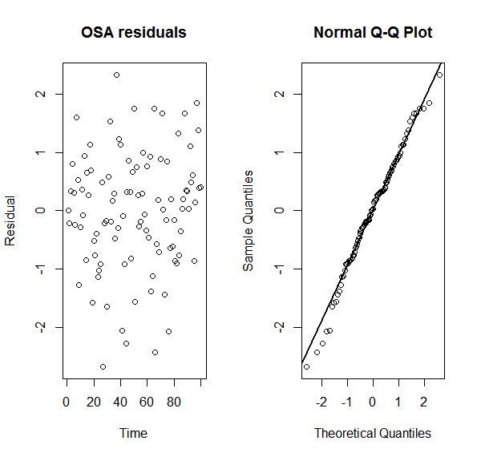

```{r echo=FALSE, eval=TRUE, results='hide',include=FALSE}
library(TMB)
library(mgcv)
library(Matrix)
source("../utils.R")
```


## **One-step-ahead (OSA) residuals** 
In this example you learn:

* The basic ideas behind one-step-ahead (OSA) residuals
* How to calculate OSA residuals using TMB


***
#### Description of OSA residuals


Denote the assumed model as $M$. If $M$ represents the true underlying structure, the OSA residuales are standard Gaussian distributed. The OSA residual are defined as 
\begin{align}
Z_i = \Phi^{-1}(U_i), \hspace{3mm} \text{ where }\hspace{3mm}  U_i = P^M(Y_i\leq y_i | Y^{i-1} = y^{i-1}).
\end{align}
Here $y^{i-1} = \{y^1,...,y^{i-1}\}$ denotes all observations up to $i$. Tecnical details how $Z_i$ is calculated inside TMB is given in section 4 in [(Thygesen et al., 2017)](https://www.researchgate.net/profile/Uffe_Thygesen/publication/316581864_Validation_of_ecological_state_space_models_using_the_Laplace_approximation/links/590c7401458515897e4df9c8/Validation-of-ecological-state-space-models-using-the-Laplace-approximation.pdf). 

<details> <summary> Details about the example model used: </summary> 

The example used in this case study is borrowed from [(Thygesen et al., 2017)](https://www.researchgate.net/profile/Uffe_Thygesen/publication/316581864_Validation_of_ecological_state_space_models_using_the_Laplace_approximation/links/590c7401458515897e4df9c8/Validation-of-ecological-state-space-models-using-the-Laplace-approximation.pdf). 

Consider the random walk

\begin{align}
X_{i+1} = X_{i} + \mu + \epsilon_i,  i = 1,...,N-1,
\end{align}

where $X_1 = 0$, $\mu$ is a constant drift term, and $\epsilon_i \sim N(0,\sigma_{\epsilon}^2)$. Assume we further observe:

\begin{align}
Y_{i} = X_{i} + \psi_i, i = 1,...,N,
\end{align}

where $\psi_i \sim N(0,\sigma_{\psi}^2)$ and independend of $\epsilon_i$.  

</details>

***

#### Full code for example
<details> <summary> R code</summary>
```{r,echo=FALSE, comment=""}
include_source("OSA.R", linesToInclud=c(1:999))
```
</details>
<details> <summary> C++ code</summary>
```{r,echo=FALSE, comment=""}
include_source("OSA.cpp", linesToInclud=c(1:999))
```
</details>

***

#### C++ code step-by-step
<details>  
  <summary>Read data from R</summary>
```c++
  DATA_VECTOR(y);                  //Observations
  DATA_VECTOR_INDICATOR(keep, y);  //Indicator variable for one-step-ahead predictions
  DATA_SCALAR(huge);    //Used to integreat out X_1
  PARAMETER_VECTOR(x);  //The latent AR1 random variables
  PARAMETER(mu);        //The drift in latent effect
  PARAMETER(logsigma);  //Log sd of epsilon
  PARAMETER(logs);      //Log sd of psi
```
</details>

<details>  
  <summary>Liklihood contribution from random effect</summary>
```c++
// Initial value
Type nll = -dnorm(x(0), Type(0), huge, true);
  
// Calculates the likelihood
for (int i = 1; i < x.size(); ++i){
  nll -= dnorm(x(i), x(i - 1) + mu, exp(logsigma), true);
}
```
</details>


<details>  
  <summary>Liklihood contribution from the observations</summary>
```c++
for (int i = 0; i < y.size(); ++i){
  nll -= keep(i) * dnorm(y(i), x(i), exp(logs), true);
}
return nll;
```
Note the `keep` vector, which is of interest in this example.
</details>


***

#### R code step-by-step
<details>  
  <summary>Simulate data</summary>
```r
set.seed(123)
## Simulate data with these parameters
mu = 0.75
sigma = 1
s = 1
huge = 1e3
nT = 100
X = c(0,cumsum(rnorm(nT-1,mean=mu,sd=sigma)))
Y = X + rnorm(nT,sd=s)
```
</details>

<details>  
<summary>Set up data structure and estimate model</summary>
```r
data = list(y=Y,huge=huge)
parameters = list(x=X,mu=0,logsigma=log(sigma),logs=log(s))
obj = MakeADFun(data,parameters,random=c("x"),DLL="OSA")
opt = nlminb(obj$par, obj$fn,obj$gr)
```
</details>


<details>  
<summary>Calcualte OSA residuals</summary>
```r
predict  <- oneStepPredict(obj,observation.name="y",method="fullGaussian",data.term.indicator = "keep")
```
The OSA residuals are now available in `predict$residual`. 

</details>

***

#### Exercise


1. 
<details>  
  <summary> The keep functionlality.</summary>
Note that only three lines of code was needed to calculate the OSA residuals. Make sure you understand these three lines of code.

</details>


2. 
<details>  
  <summary> Extract and plot the OSA residuals.</summary>
```r
predict  <- oneStepPredict(obj,observation.name="y",method="oneStepGeneric",data.term.indicator = "keep")
par(mfrow = c(1,2))
plot(predict$residual,xlab="Time", main = "OSA residuals", ylab = "Residual")
qqnorm(predict$residual)
qqline(predict$residual, lwd = 2)
```
    
</details>


3. 
<details>  
  <summary> Use OSA residuals to validate if $\mu$ is sifnificantly important to include.</summary>
  Neglecting $\mu$ will cause a bias for the latent process in the direction of the sign of $\mu$. We therefore test if the residuals are biased if not including $\mu$.
```r
obj0 = MakeADFun(data,parameters,random=c("x"),DLL="OSA",map=list(mu=factor(NA)))
opt0 = nlminb(obj0$par, obj0$fn,obj0$gr)
predict0  <- oneStepPredict(obj0,observation.name="y",method="oneStepGeneric")
print(TestPred = anova(lm(predict$residual ~ 0),lm(predict$residual ~ 1)))
print(TestPred0 = anova(lm(predict0$residual ~ 0),lm(predict0$residual ~ 1)))
```
</details>


