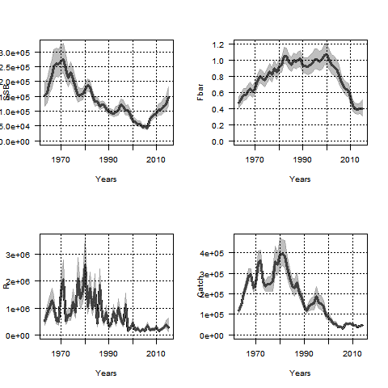
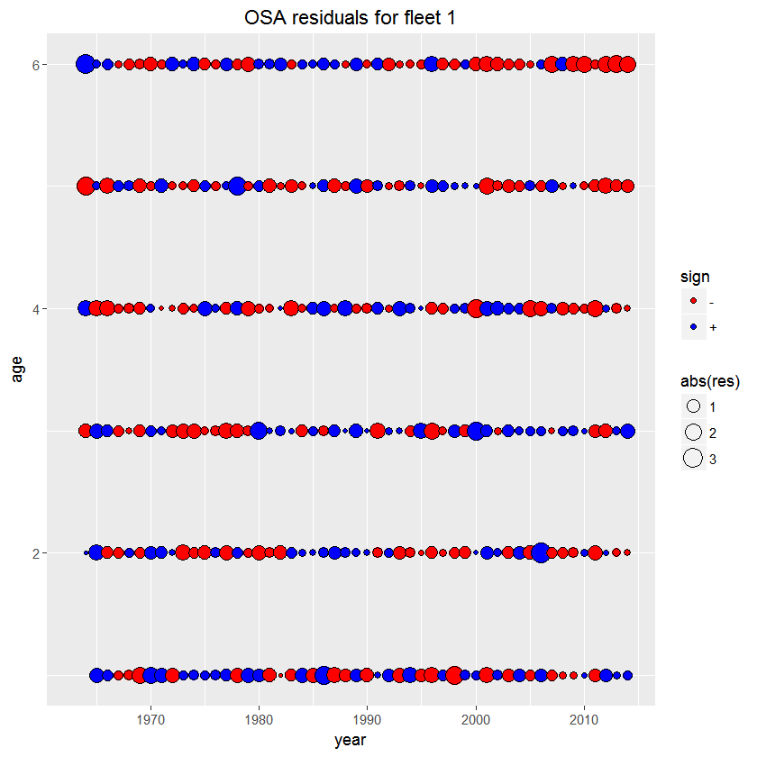

```{r echo=FALSE, eval=TRUE, results='hide',include=FALSE}
library(TMB)
library(mgcv)
library(Matrix)
source("../utils.R")
```


## **Stock assessment model (SAM)** 
In this example you learn:

* The details of the SAM model (TMB implementation).
* How to extract quantities used in stock assessment from SAM.

For pedagogical reasons SAM is presented as three separate components:

1. [Recruitment](https://github.com/skaug/tmb-case-studies/tree/master/SAM/recruitment)
2. [Survival](https://github.com/skaug/tmb-case-studies/tree/master/SAM/survival)
3. [Observations](https://github.com/skaug/tmb-case-studies/tree/master/SAM/observations) 

It is recommended that you do this exercises before you continue. You should then be able
to recognize the parts 1-3 when you look at the SAM code below. 


***
#### Description of the practical situation
In this case study we model the population of North Sea cod with use of assessment model SAM [(Nielsen et al., 2014)](https://doi.org/10.1016/j.fishres.2014.01.014). The example is similar as the example given [here](https://github.com/fishfollower/samex) by Anders Nielsen.
Let $N_{a,y}$ be the number of cod of age $a$ in year $y$. The number of fish next year equals the number of fish this year minus those who have died and added those who have been born. This can be expressed mathematically as:

$\begin{align}
\log N_{1,y} &= \log R({\bf N}_{y-1}) + \eta_{1,y} \\
\log N_{a,y} &= \log N_{a-1,y-1} - F_{a-1,y-1} - M_{a-1,y-1} + \eta_{a,y}\\
\log N_{A,y} &= \log (N_{A-1,y-1} e^{- F_{A-1,y-1} - M_{A-1, y-1}} + N_{A,y-1} e^{ - F_{A,y-1} - M_{A, y-1}}) + \eta_{A,y}
 \end{align}$

where $R(\cdot)$ is a function describing the spawning productivity of the cod, $A$ represents a maximum age, $F$ represents the fishing mortality and $M$ the natural mortality. It is assumed that the process error $\eta_{a,y}$ is iid N(0,$\sigma_{\eta,a}^2$), i.e. independently normally distributed. We combine all age specific quantites into vectors: 
${\bf N}_{y}=(N_{1,y},\ldots,N_{A,y})$ and ${\bf F}_{y}=(F_{1,y},\ldots,F_{A,y})$.

<details> <summary> Details about fishing mortality and observation equations </summary> 

We assume that the fishing mortality is given by 
\begin{align}
\log {\bf F}_y = \log {\bf F}_{y-1} + \pmb{\xi_y},
\end{align}
where $\pmb{\xi_y} \sim N(0,\pmb{\Sigma}_{\xi})$, i.e. multivariate normally distributed with covariance matrix 
$\pmb{\Sigma}_{\xi}$. The observable data are time series of commercial catches and survey indexes which are assumed given by:

$\begin{align}
\log C_{a,y} &= \log \Big( \frac{F_{a,y}}{F_{a,y} + M_{a,y}} (1- e^{-F_{a,y} - M_{a,y}})N_{a,y} \Big) + \epsilon^c_{a,y} \\
\log I_{y}^{(s)} &= \log ( Q_a^{(s)} e^{-(F_{a,y} + M_{a,y})day^{(s)}/365} N_{a,y}) + \epsilon^s_{a,y}   \\
\end{align}$

It is assumed that  $\pmb{\epsilon}^c \sim N(0,\pmb{\Sigma}_c)$and $\pmb{\epsilon}^{s} \sim N(0,\pmb{\Sigma}_s)$. These time series are the observations used to estimate the parameters in SAM.
</details>

<details> <summary> Example data: survey and commercial data in year 1999.</summary>
```{r,echo=FALSE, comment=""}
#head(Vegetation,5)
load("input.RData")
rownames(data$obs) <- NULL
print(data$obs[which(data$obs[,1]==1999),1:4])
```
</details>

***

#### Full code for example
<details> <summary> R code</summary>
```{r,echo=FALSE, comment=""}
include_source("sam.R", linesToInclud=c(1:999))
```
</details>
<details> <summary> C++ code</summary>
```{r,echo=FALSE, comment=""}
include_source("sam.cpp", linesToInclud=c(29:999))
```
</details>

***

#### C++ code step-by-step
<details>  
  <summary>Read data from R</summary>
```c++
  DATA_VECTOR(fleetTypes);    //Indicator variables for data types
  DATA_VECTOR(sampleTimes);   //Time in year the time series is collected
  DATA_INTEGER(nobs);         //Number of observations
  DATA_ARRAY(obs);            //Observations from every year, fleet and age.
  DATA_ARRAY(propMat);        //Proportion mature
  DATA_ARRAY(stockMeanWeight);//Estimated mean weight in population
  DATA_ARRAY(catchMeanWeight);//Estimated mean weight in catch
  DATA_ARRAY(natMor);         //Natural mortality
  DATA_INTEGER(minAge);       //Minimum age
  DATA_INTEGER(maxAge);       //Maximum age
  DATA_INTEGER(maxAgePlusGroup); //Indicator variable stating if we have defined a pluss group
  DATA_IARRAY(keyLogFsta);    //Used for defining fishing mortality equal for several ages
  DATA_INTEGER(corFlag);      //Variable defining correlation strucutre for F
  DATA_IARRAY(keyLogFpar);    //Variable used for catchability
  DATA_IARRAY(keyVarF);       //Variable used for setting variances in F equal
  DATA_IARRAY(keyVarLogN);    //Variable used for setting variances in \eta equal
  DATA_IARRAY(keyVarObs);     //Variable used for setting variances in observations equal
  DATA_INTEGER(stockRecruitmentModelCode); //Variable used for choosing recrutiment model
  DATA_INTEGER(noScaledYears);    //Number of years we just know the scaled catch
  DATA_IVECTOR(keyScaledYears);   //Which year do we just know the scaled catch
  DATA_IMATRIX(keyParScaledYA);   //Variable used for estimating scaling
  DATA_IVECTOR(fbarRange);        //Age range of fbar
```
</details>

<details>
  <summary>Read parameters from R</summary>
```c++
  PARAMETER_VECTOR(logFpar);      //Catchaility (Q_s^a)
  PARAMETER_VECTOR(logSdLogFsta); //Log standatd deviation of F
  PARAMETER_VECTOR(logSdLogN);    //Log standatd deviation of \eta
  PARAMETER_VECTOR(logSdLogObs);  //Log standatd deviation of observations
  PARAMETER_VECTOR(rec_loga); //Recruitment parameter
  PARAMETER_VECTOR(rec_logb); //Recruitment parameter
  PARAMETER(logit_rho);       //Used in correlation structure for F
  PARAMETER_VECTOR(logScale); //Scaling parameters in those year we just know the scaled catch
  PARAMETER_ARRAY(logF);      //Random effect for F
  PARAMETER_ARRAY(logN);      //Random effect for \eta
```
</details>

<details>
  <summary>Define some parameters used internally in the program</summary>
```c++
  int timeSteps=logF.dim[1];
  int stateDimF=logF.dim[0];
  int stateDimN=logN.dim[0];
  Type rho=f(logit_rho);
  vector<Type> sdLogFsta=exp(logSdLogFsta);
  vector<Type> varLogN=exp(logSdLogN*Type(2.0));
  vector<Type> varLogObs=exp(logSdLogObs*Type(2.0));
  vector<Type> ssb(timeSteps);
  vector<Type> logssb(timeSteps);
  vector<Type> fbar(timeSteps);
  vector<Type> logfbar(timeSteps);
  vector<Type> cat(catchMeanWeight.dim(0));
  vector<Type> logCatch(catchMeanWeight.dim(0));
  vector<Type> tsb(timeSteps);
  vector<Type> logtsb(timeSteps);
  vector<Type> logR(timeSteps);
  vector<Type> R(timeSteps);
  matrix<Type> fvar(stateDimF,stateDimF);
  matrix<Type> fcor(stateDimF,stateDimF);
  vector<Type> fsd(stateDimF);
```
</details>

<details>
  <summary>Calculate the covariance matrix $\pmb{\Sigma}_{\xi}$ for the fishing mortality </summary>
```c++
  for(int i=0; i<stateDimF; ++i){
    fcor(i,i)=1.0;
  }

  if(corFlag==1){
    for(int i=0; i<stateDimF; ++i){
      for(int j=0; j<i; ++j){
        fcor(i,j)=rho;
        fcor(j,i)=fcor(i,j);
      }
    }
  }
  if(corFlag==2){
    for(int i=0; i<stateDimF; ++i){
      for(int j=0; j<i; ++j){
        fcor(i,j)=pow(rho,abs(Type(i-j)));
        fcor(j,i)=fcor(i,j);
      }
    }
  }

  int i,j;
  for(i=0; i<stateDimF; ++i){
    for(j=0; j<stateDimN; ++j){
      if(keyLogFsta(0,j)==i)break;
    }
    fsd(i)=sdLogFsta(keyVarF(0,j));
  }

  for(i=0; i<stateDimF; ++i){
    for(j=0; j<stateDimF; ++j){
      fvar(i,j)=fsd(i)*fsd(j)*fcor(i,j);
    }
  }
```
</details>

<details>
  <summary>Calculates the likelihood contribution from process model for fishing mortality $F$ </summary>
```c++
  using namespace density;
  MVNORM_t<Type> neg_log_densityF(fvar);
  for(int i=1;i<timeSteps;i++){
    nll+=neg_log_densityF(logF.col(i)-logF.col(i-1)); // F-Process likelihood
  }
```
</details>

<details>
  <summary>Calculates the SSB, used to predict recruitment </summary>
```c++
  for(int i=0;i<timeSteps;i++){ // calc ssb
    ssb(i)=0.0;
    for(int j=0; j<stateDimN; ++j){
        ssb(i)+=exp(logN(j,i))*propMat(i,j)*stockMeanWeight(i,j);
    }
    logssb(i)=log(ssb(i));
  }
```
</details>

<details> <summary> Calculates the likelihood contribution from the process model for $N$ (equations above).  </summary>
```c++
  matrix<Type> nvar(stateDimN,stateDimN);
  for(int i=0; i<stateDimN; ++i){
    for(int j=0; j<stateDimN; ++j){
      if(i!=j){nvar(i,j)=0.0;}else{nvar(i,j)=varLogN(keyVarLogN(0,i));}
    }
  }
  MVNORM_t<Type> neg_log_densityN(nvar);
  vector<Type> predN(stateDimN);
  for(int i=1;i<timeSteps;i++){
    if(stockRecruitmentModelCode==0){ // straight RW
      predN(0)=logN(0,i-1);
    }else{
      if(stockRecruitmentModelCode==1){//ricker
        predN(0)=rec_loga(0)+log(ssb(i-1))-exp(rec_logb(0))*ssb(i-1);
      }else{
        if(stockRecruitmentModelCode==2){//BH
          predN(0)=rec_loga(0)+log(ssb(i-1))-log(1.0+exp(rec_logb(0))*ssb(i-1));
        }else{
          error("SR model code not recognized");
        }
      }
    }

    for(int j=1; j<stateDimN; ++j){
      if(keyLogFsta(0,j-1)>(-1)){
        predN(j)=logN(j-1,i-1)-exp(logF(keyLogFsta(0,j-1),i-1))-natMor(i-1,j-1);
      }else{
        predN(j)=logN(j-1,i-1)-natMor(i-1,j-1);
      }
    }
    if(maxAgePlusGroup==1){
      predN(stateDimN-1)=log(exp(logN(stateDimN-2,i-1)-exp(logF(keyLogFsta(0,stateDimN-2),i-1))-natMor(i-1,stateDimN-2))+
                               exp(logN(stateDimN-1,i-1)-exp(logF(keyLogFsta(0,stateDimN-1),i-1))-natMor(i-1,stateDimN-1)));
    }
    nll+=neg_log_densityN(logN.col(i)-predN); // N-Process likelihood
  }
```
</details>

<details>
<summary> Calculates the likelihood contribution from the observations (indexes and commercial landings)   </summary>
```c++
  int f, ft, a, y,yy, scaleIdx;
  int minYear=CppAD::Integer((obs(0,0)));
  Type zz;
  vector<Type> predObs(nobs);
  vector<Type> predSd(nobs);
  for(int i=0;i<nobs;i++){
    y=CppAD::Integer(obs(i,0))-minYear;
    f=CppAD::Integer(obs(i,1));
    ft=CppAD::Integer(fleetTypes(f-1));
    a=CppAD::Integer(obs(i,2))-minAge;
    zz=exp(logF(keyLogFsta(0,a),y))+natMor(y,a);

    switch(ft){
      case 0:
        predObs(i)=logN(a,y)-log(zz)+log(1-exp(-zz));
        if(keyLogFsta(f-1,a)>(-1)){
          predObs(i)+=logF(keyLogFsta(0,a),y);
        }
        scaleIdx=-1;
        yy=CppAD::Integer(obs(i,0));
        for(int j=0; j<noScaledYears; ++j){
          if(yy==keyScaledYears(j)){
            scaleIdx=keyParScaledYA(j,a);
            if(scaleIdx>=0){
              predObs(i)-=logScale(scaleIdx);
            }
            break;
          }
        }
        break;

        case 2:
          predObs(i)=logN(a,y)-zz*sampleTimes(f-1);
          if(keyLogFpar(f-1,a)>(-1)){
            predObs(i)+=logFpar(keyLogFpar(f-1,a));
          }

        break;

        default:
          std::cerr<<"Unknown fleet code: "<<ft<<std::endl;
        return 0 ;
        break;
    }
    predSd(i)=sqrt(varLogObs(keyVarObs(f-1,a)));
    nll+=-dnorm(log(obs(i,3)),predObs(i),predSd(i),true);
  }
```
</details>

<details>
<summary>Calculates the average fishery mortality ($\bar F$), which is returned for illustration </summary>
```c++
  for(int y=0;y<timeSteps;y++){
    fbar(y)=Type(0);
    for(int a=fbarRange(0);a<=fbarRange(1);a++){
      fbar(y)+=exp(logF(keyLogFsta(0,a-minAge),y));
    }
    fbar(y)/=Type(fbarRange(1)-fbarRange(0)+1);
    logfbar(y)=log(fbar(y));
  }
```
</details>

<details>
<summary>Calculates the estimated catch, which is returned for illustration </summary>
```c++
  for(int y=0;y<catchMeanWeight.dim(0);y++){
    cat(y)=Type(0);
    for(int a=minAge;a<=maxAge;a++){
      Type z=exp(logF(keyLogFsta(0,a-minAge),y))+natMor(y,a-minAge);
      cat(y)+=exp(logF(keyLogFsta(0,a-minAge),y))/z*exp(logN(a-minAge,y))*(Type(1.0)-exp(-z))*catchMeanWeight(y,a-minAge);
    }
    logCatch(y)=log(cat(y));
  }
```
</details>

<details>
<summary>Calculates the recruitment, which is returned for illustration </summary>
```c++
  for(int y=0;y<timeSteps;y++){  
    logR(y)=logN(0,y);
    R(y)=exp(logR(y));
  }
```
</details>


<details>
<summary>Report what we want to report </summary>
```c++
  ADREPORT(logssb);
  ADREPORT(logfbar);
  ADREPORT(logCatch);
  ADREPORT(logR);
```
</details>


***
#### Exercise

1. 
<details>  
  <summary> Fit the model and collect the returned uncertainty estimates by TMB.</summary>
```r
  obj <- MakeADFun(data,parameters,random=c("logN","logF"),DLL="sam")
  opt<-nlminb(obj$par,obj$fn,obj$gr,control=list(trace=1,eval.max=1200,iter.max=900))
  sdrep<-sdreport(obj)
```
</details>

2. 
<details>  
  <summary> Plot the estimated SSB, $\bar F$, recruitment and the estimated catch.</summary> 
  For convenience we first construct the following plotting function:
  
    ```r
      plotit <-function (what, x=data$years, ylab=what, xlab="Years", trans=function(x)x ,...){
      idx<-names(sdrep$value)==what
      y<-sdrep$value[idx]
      ci<-y+sdrep$sd[idx]%o%c(-2,2)
      plot(x,trans(y), xlab=xlab, ylab=ylab, type="l", lwd=3, ylim=range(c(trans(ci),0)), las=1,...)
      polygon(c(x,rev(x)), y = c(trans(ci[,1]),rev(trans(ci[,2]))), border = gray(.5,alpha=.5), col = gray(.5,alpha=.5))
      grid(col="black")
    }
    ```
    We then construct the plots:
    
    ```r
      pl <- as.list(sdrep,"Est")
      plsd <- as.list(sdrep,"Std")
      par(mfrow=c(2,2))
      options(scipen=-3)
      plotit("logssb", ylab="SSB", trans=exp)
      plotit("logfbar", ylab="Fbar", trans=exp)
      plotit("logR", ylab="R", trans=exp)
      plotit("logCatch", ylab="Catch", trans=exp, x=data$years[-length(data$years)])
    ```
    
    
</details>

3. 
<details>  
  <summary> Calculate and plot one-step-ahead prediction residuals (OSA).</summary> 
  See [documentation](https://www.rdocumentation.org/packages/TMB/versions/1.7.13/topics/oneStepPredict) for description of OSA and the function `oneStepPredict()` for calculating OSA in TMB. OSA is calculated by including an indicator variable,`keep`, which is used for removing data from the likelihood. In the C++ part we modify:
  
    ```c++
      DATA_VECTOR(obsVec); //Include the observation as a vector (needed when using oneStepPredict)
      DATA_VECTOR_INDICATOR(keep, obsVec);  //Structure needed for one-step predictions
      
      //nll+=- dnorm(log(obs(i,3)),predObs(i),predSd(i),true);
      nll+=- keep(i)*dnorm(obsVec(i),predObs(i),predSd(i),true);
    }
    ```
    In the R part we modify:
    
    ```r
      data$obsVec = log(data$obs[,4]) 
      
      predict  <- oneStepPredict(obj,observation.name="obsVec",
                           data.term.indicator = "keep", discrete = FALSE)
    ```
    
    Plot the residuals:
    ```r
      tmp = as.data.frame(data$obs)
      tmp$res = predict$residual
      tmp$sign = rep("+",length(tmp$res))
      tmp$sign[tmp$res<0] = "-"
      tmp =tmp[tmp$fleet==1,]
      
      library(ggplot2)
      resPlot <- ggplot(tmp, aes(x = year, y = age, size = abs(res),fill = sign)) +
        geom_point(shape = 21)+
        ggtitle("OSA residuals for fleet 1")
      fill = c("red", "blue")
      resPlot <- resPlot + scale_fill_manual(values = fill)
      resPlot
    ```

    
    
</details>


