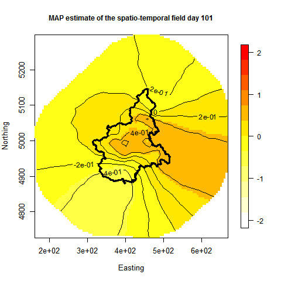
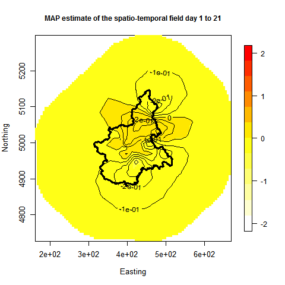

```{r echo=FALSE, eval=TRUE, results='hide',include=FALSE}
library(TMB)
library(mgcv)
library(Matrix)
source("../utils.R")
```


## **Spatio-temporal modeling with (approximate) Matern $\otimes$ AR1 covariance functions ** 
In this example you learn:

* How to use the SPDE approximation of a Matern spatial random field in TMB combined with an AR1 structure for spatio-temporal modeling.
* How to increase the dimension of your random field in TMB by assuming separability.

<div style="width:350px; height:350px">


</div>

*Figure: Illustration of the spatio-temporal random field estimated in this case study.*

***
#### Description of the practical situation
In this case study we use a spatio-temporal Gaussian random field to model consentration of air pollution (PM10). The example is taken from [Cameletti et al. (2012)](https://www.math.ntnu.no/inla/r-inla.org/case-studies/Cameletti2012/Cameletti_et_al_2012_acc.pdf). Let $Y({\bf s},t)$ be the observed log PM10 at location ${\bf s}$ and time $t$. We assume that $Y({\bf s},t) \sim N(\mu({\bf s},t), \sigma^2)$, were
\begin{align}
\mu({\bf s},t) = \pmb{\beta}\pmb{X} + \gamma({\bf s},t).
\end{align}
Here $\pmb{X}$ is the design matrix for the fixed effects, $\pmb{\beta}$ is regression coefficients and $\pmb{\gamma}$ is a spatio-temporal latent field. We assume that the spatio-temporal latent field has the following structure:
\begin{align}
\pmb{\gamma}_t = \rho \pmb{\gamma}_{t-1} + \pmb{\xi},
\end{align}
were $\pmb{\xi} \sim N({\bf 0},\pmb{\Sigma}_s)$ and $\pmb{\Sigma}_s$ is a Matern covariance matrix. In this case study it is the spatio-temporal latent field $\pmb{\gamma}$ which is of interest.

<details> <summary> Details about the spatio-temporal component $\pmb{\gamma}$. </summary> 
Notice that $\pmb{\gamma} \sim N({\bf 0}, \pmb{\Sigma}_{st})$, were $\pmb{\Sigma}_{st} = \pmb{\Sigma}_{s}\otimes\pmb{\Sigma}_{t}$, were $\pmb{\Sigma}_{t}$ is an AR1 covariance matrix. TMB uses computational efficient algorithms which utilize this separable covariance structure. See e.g. [Cosandey et al. (2014)](http://www.nrcresearchpress.com/doi/abs/10.1139/cjfas-2014-0159) and  [Breivik et al. (2017)](https://www.sciencedirect.com/science/article/pii/S0165783616303265) for examples of such a structures used in fishery science.
</details>

<details> <summary> Summary of data.</summary>
The data is the same as used in [Cameletti et al. (2012)](http://www.r-inla.org/examples/case-studies/cameletti-et-al).
```{r,echo=FALSE, comment=""}
Piemonte_data <-read.table("Piemonte_data_byday.csv",header=TRUE,sep=",")
head(Piemonte_data,5)
```
* `UTMX,UTMY` = $s$ (spatial location)
</details>

***

#### Full code for example
<details> <summary> R code</summary>
```{r,echo=FALSE, comment=""}
include_source("SPDExAR1.R", linesToInclud=c(1:999))
```
</details>

<details> <summary> C++ code</summary>
```{r,echo=FALSE, comment=""}
include_source("SPDExAR1.cpp", linesToInclud=c(1:999))
```
</details>


***
#### C++ code step-by-step
<details>  
  <summary>Include libraries </summary>
```c++
  using namespace density; //Include since we use the function GMRF()
  using namespace R_inla; //Include since we use the function Q_spde()
  using namespace Eigen; //Include for utilization of sparce precision structures
```
</details>

<details>  
  <summary>Include data</summary>
```c++
  DATA_VECTOR(logPM10); //The response
  DATA_MATRIX(X); //Design matrix for fixed effects
  DATA_INTEGER(n_data); //Number of data points
  DATA_INTEGER(maxDt);//Number of intervalls in the AR1 structure
  DATA_INTEGER(lengthDt); //Length of time intervalls in the AR1 strucutre
  DATA_STRUCT(spdeMatrices,spde_t);//The three matrices from R-INLA which defines the sparce spatial precision structure.
  DATA_SPARSE_MATRIX(A);//Matrix for interpolating points within triangles
  DATA_VECTOR(aLoc); //Help variable for interpoalation of points within triangles
  DATA_INTEGER(flag); // flag=0 => only prior retuned, used when we normalize outside of C++
```
</details>

<details>  
  <summary>Include parameters</summary>
```c++
  PARAMETER_VECTOR(beta); //Regression coefficients
  PARAMETER(log_tau); //Parameter in the Matern covariance function
  PARAMETER(log_kappa);//Parameter in the Matern covariance function
  PARAMETER(rhoTan);//Parameter in the AR1 covariance function
  PARAMETER_ARRAY(x);//The spatio-temporal latent field
  PARAMETER(logSigmaE);//Parameter for unexplained variation
```
</details>

<details>  
  <summary>Transform some of the parameters </summary>
```c++
  Type tau = exp(log_tau);
  Type kappa = exp(log_kappa);
  Type sigmaE = exp(logSigmaE);
  Type rho = tanh(rhoTan);
```
</details>

<details>  
  <summary>Use R_inla functionality for defining the sparce spatial precision matrix </summary>
```c++
  SparseMatrix<Type> Q_s = Q_spde(spdeMatrices,kappa); //Use R_inla functionality for defining the sparce spatio-temporal precision matrix
```
</details>

<details>  
  <summary>Define the objective function </summary>
```c++
  Type nll = 0;
```
</details>

<details>  
  <summary>Add the likelihood contribution by the random effect </summary>
```c++
  nll += GMRF(Q_s,false)(x.col(0)*sqrt(1-rho*rho));                     
  for(int i=1;i<maxDt;i++){
    nll += GMRF(Q_s,false)(x.col(i)-rho*x.col(i-1));                            
  }
```
Note that we add some extra variation in the first time intervall. This is done such that the spatio-temporal field becomes stationary, see e.g. page 169 in [Cressie and Wikle (2011)](https://books.google.no/books?hl=no&lr=&id=4L_dCgAAQBAJ&oi=fnd&pg=PP1&dq=statistics+for+spatio-temporal+data&ots=icU-XKIhY-&sig=ZCwK3TpWe8xiMRsA0p4UmviGiJo&redir_esc=y#v=onepage&q=statistics%20for%20spatio-temporal%20data&f=false]).
</details>

<details>  
  <summary>Return the prior for the spatio-temporal field on request </summary>
```c++
  if (flag == 0) return nll;
```
</details>

<details>  
  <summary>Calculate the contribution to the linear predictor by fixed effects </summary>
```c++
  vector<Type> eta = X*beta;
```
</details>

<details>  
  <summary>Calulates negative log likelihood contribution from observations </summary>
```c++
  int counter = 0;
  for(int i = 0; i<maxDt; ++i){
  vector<Type> gammaDt = (A*vector<Type> (x.col(i)));
    for(int j =0; (j<lengthDt & counter <n_data); ++j){
      Type mu;

      mu = eta(counter) + gammaDt(CppAD::Integer(aLoc(j)))/tau;
      if(logPM10(counter)>(-99)){
         nll -= dnorm(logPM10(counter), mu, sigmaE,true);
      }
      counter++;
    }
  }
  //---------------------------------------------
```
</details>

<details>  
  <summary>Return the objective function </summary>
```c++
  return nll;
```
</details>

***

#### R code step-by-step
<details>  
  <summary>Include libraries</summary>
```r
  library(INLA)
  library(TMB)
```
</details>

<details>  
  <summary>Compile and load c++ code</summary>
```r
  compile("SPDExAR1.cpp")
  dyn.load(dynlib("SPDExAR1"))
```
</details>

<details>  
  <summary>Read data</summary>
```r
  borders <-read.table("Piemonte_borders.csv",header=TRUE,sep=",")
  Piemonte_data <-read.table("Piemonte_data_byday.csv",header=TRUE,sep=",")
  coordinates <-read.table("coordinates.csv",header=TRUE,sep=",")
  rownames(coordinates) = coordinates[,"Station.ID"]
```
</details>

<details>  
  <summary>Define some variables used</summary>
```r
  n_stations <- length(coordinates$Station.ID)
  n_data <- length(Piemonte_data$Station.ID)
  n_days <- as.integer(n_data/n_stations)
```
</details>

<details>  
  <summary>Standardize covariates</summary>
```r
  sd_covariates = apply(Piemonte_data[,3:10],2,sd)
  Piemonte_data[,3:10] =
    scale(Piemonte_data[,3:10],
          mean_covariates, sd_covariates)
```
</details>

<details>  
  <summary>Log transform reponse, and set not observed to a certain value</summary>
```r
  Piemonte_data$logPM10 = log(Piemonte_data$PM10)
  Piemonte_data$logPM10[which(is.na(Piemonte_data$logPM10))]=-999
```
</details>

<details>  
  <summary>Calculates days since first observation</summary>
```r
Piemonte_data$day = rep(0,n_data)
for(i in 1:n_days){
  for(j in 1:n_stations){
    Piemonte_data$day[(i-1)*n_stations + j] = i-1
  }
}
```
</details>

<details>  
  <summary>Group the days into intervalls used in the AR1 process</summary>
```r
  dtLength = 21#Length of time intervalls
  Piemonte_data$dt = floor(Piemonte_data$day/dtLength)
  lengthDt = sum(Piemonte_data$dt==0)#Number of observations within each time intervall
  maxDt = max(Piemonte_data$dt)+1 
```
</details>

<details>  
  <summary>Set up variables needed in the SPDE procedure</summary>
```r
  locStations = cbind(coordinates$UTMX,
              coordinates$UTMY)
  mesh =
    inla.mesh.2d(loc=locStations,
                 loc.domain=borders,
                 offset=c(10, 140),
                 max.edge=c(40, 80),
                 min.angle=c(26, 21),
                 cutoff=0
    )
  
  spde = inla.spde2.matern(mesh=mesh, alpha=2)
  spdeMatrices = spde$param.inla[c("M0","M1","M2")]
  A = inla.spde.make.A(mesh,locStations)
  aLoc = rep((1:dim(locStations)[1]),dtLength)-1 #Help variable for interpolation
```
</details>

<details>  
  <summary>Define the design matrix for the fixed effects</summary>
```r
X <- model.matrix( ~ 1 + Piemonte_data$A + Piemonte_data$UTMX + Piemonte_data$UTMY +
                     Piemonte_data$WS + Piemonte_data$TEMP + Piemonte_data$HMIX +
                     Piemonte_data$PREC + Piemonte_data$EMI , data = Piemonte_data)
```
</details>

<details>  
  <summary>Define the data object given to TMB</summary>
```r
data <- list(logPM10 = Piemonte_data$logPM10,
             n_data = n_data,
             lengthDt = lengthDt,
             maxDt = maxDt,
             A = A,
             aLoc = aLoc,
             X = as.matrix(X),
             spdeMatrices = spdeMatrices
  )
```
</details>

<details>  
  <summary>Define the parameter object given to TMB</summary>
```r
  parameters <- list(beta      = c(3,rep(0,8)),
                     log_tau   = 4,
                     log_kappa = -4,
                     rhoTan = 0,
                     x  = array(0,dim = c(mesh$n,maxDt)),
                     logSigmaE = -1)
```
</details>

<details>  
  <summary>Estimate the model</summary>
```r
  data$flag = 1
  obj <- TMB::MakeADFun(data,parameters,random = c("x"),DLL = "SPDExAR1")
  obj <- normalize(obj, flag="flag")
  opt<-stats::nlminb(obj$par,obj$fn,obj$gr,control=list(eval.max=1000, iter.max=1000))
  rep<- sdreport(obj)
```
</details>


***
#### Exercise


1. 
<details>  
  <summary> Plot the MAP estimat of the spatio-temporal field for some time periods.</summary>
  We create a .git file to show the variation in time:
```r
  library(fields) #To use image.plot()
  library(animation) #To make .gif-file
  saveGIF({
    for(dtPlot in 1:(maxDt-1)){
      proj = inla.mesh.projector(mesh)
      gammaindeks = which(names(rep$par.random)=="gamma")
      gammaindeks = which(names(rep$par.random)=="xVec")
      XYUTM = mesh$loc[,1:2]
      indexOfGammaToPlot = ((dtPlot)*mesh$n+1):((dtPlot+1)*mesh$n)
      gamma = rep$par.random[indexOfGammaToPlot]/exp(rep$par.fixed[which(names(rep$par.fixed)=="log_tau")])
      latentFieldML = gamma
      image.plot(proj$x,proj$y, inla.mesh.project(proj, latentFieldML),col =  colorRampPalette(c("white","yellow", "red"))(12),
                 xlab = 'Easting', ylab = 'Northing',
                 zlim = c(-2,2),
                 main = paste("MAP estimate of the spatio-temporal field day ", (dtPlot-1)*dtLength +1 ," to ",dtPlot*dtLength,sep = ""),
                 cex.lab = 1.1,cex.axis = 1.1, cex.main=1, cex.sub= 1.1)
      contour(proj$x, proj$y,inla.mesh.project(proj, latentFieldML) ,add = T,labcex  = 1,cex = 1)
      lines(borders, lwd=3)}
    }, movie.name = "SPDExAR1Kron.gif")
```
  


2. 
<details>  
  <summary> Use the `SEPARABLE` function in TMB to define the spatio-temporal structure and investigate if we get the same results.</summary>
  Note that the precision matrix for $\pmb{\gamma}$ is seperable, i.e. $\pmb{\Sigma}_{st} = \pmb{\Sigma}_{s}\otimes\pmb{\Sigma}_{t}$. We can include this strucutre in the template by removing the state space formulation and replacing it with a GMRF represented with precision matrix $\pmb{\Sigma}_{s}\otimes\pmb{\Sigma}_{t}$:
```c++
  //nll = GMRF(Q_s,false)(x.col(0)*sqrt(1-rho*rho));                            
  //for(int i=1;i<maxDt;i++){
  //  nll += GMRF(Q_s,false)(x.col(i)-rho*x.col(i-1));                          
  //}
  nll = SEPARABLE(AR1(rho), GMRF(Q_s))(x);
```
Note that we include the normalizing constant in the AD machinery here, we therefor need to remove:
```r
  #obj <- normalize(obj, flag="flag")                           
```
on the R side. Including the normalizing constant is observed to be faster compared to calculating it on the R side when using the `SEPARABLE` function in this example. If the mesh were larger, it may be bette to calculate the normlizing constant on the R side. 
3. 
<details>  
  <summary> Define manually the full precision matrix and investigate if we get the same results.
  Hint:</summary>
  The full precision matrix can be derived as follows in c++, see page 169 in [Cressie and Wikle (2011)](https://books.google.no/books?hl=no&lr=&id=4L_dCgAAQBAJ&oi=fnd&pg=PP1&dq=statistics+for+spatio-temporal+data&ots=icU-XKIhY-&sig=ZCwK3TpWe8xiMRsA0p4UmviGiJo&redir_esc=y#v=onepage&q=statistics%20for%20spatio-temporal%20data&f=false]).
```c++
  MatrixXd m =MatrixXd::Identity(maxDt, maxDt);
  for(int i=0;i<maxDt; i++) {
        for(int j=i;j<maxDt; j++){
          if(i==j){
            m(i,j) = m(i,j) + rho*rho;
          }else if(abs(i-j)==1){
            m(i,j) = -rho;
            m(j,i) = -rho;
          }
        }
  } 
  m(0,0) = 1;m(maxDt-1,maxDt-1) = 1; //Edge effects
  SparseMatrix<Type> Q_t = asSparseMatrix(m);
  SparseMatrix<Type> Q_st = kronecker(Q_t,Q_s);
```

</details>


