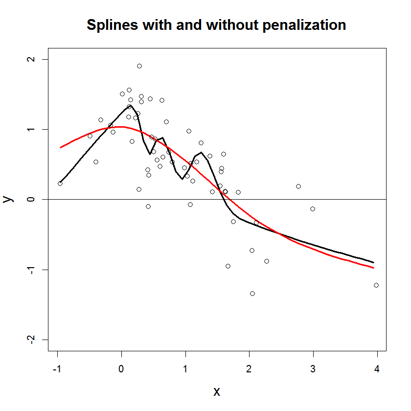

```{r echo=FALSE, eval=TRUE, results='hide',include=FALSE}
library(TMB)
library(mgcv)
library(Matrix)
source("../utils.R")
source("pSplines.R")
```


## **GAM model based on P-splines**
In this example you learn:

* How to estimate a model with P-splines (penalized splines) in TMB.
* How to set up the spline part of the model in the `mgcv` package. 
* How to extract standard errors of a spline in TMB.
* How to input "complex datastructures" from R to C++ via _sparse matrices_.

***
#### Description of the practical situation
Let $Y(d)$ be the biodiversity, as given by the variable `Richness` in the data. We assume that $Y(d) \sim N(\mu,\sigma^2)$, were 
$$\mu = \beta_0 +  f_1(rock) +f_2(litter) + f_3(soil) + f_4(fallPrec) + f_5(sprTmax).$$
Here, $f_1,\ldots,f_5$ are splines, modelled as function of covariates `rock`, `litter`,... (see data summary below).
See page 63 in Zuur (2009) for a similar example with use of the same data.
<details> <summary> "Penalizing the splines": how to get an appropriate level of smoothness?</summary>
We let the coefficients ($\beta$) of the $i$th spline have a multivariate normal distribution with precision matrix $\lambda_i \pmb{S}_i$, where $\lambda_i$ is a penalization parameter and $\pmb{S}_i$ is a penalization matrix extracted from the R-package `mgcv`. The matrices $\pmb{S}_i$ are singular, and hence the multivariate normal distributions are degenerate. However, when bringing in data through the likelihood, the (posterior) precission matrix becomes non-singular. See [Wood (2017)](https://books.google.no/books?id=JTkkDwAAQBAJ&printsec=frontcover&dq=generalized+additive+models+wood+2017&hl=no&sa=X&ved=0ahUKEwjp4o2sicHbAhWEFZoKHaHYBQ0Q6AEIJzAA#v=onepage&q=generalized%20additive%20models%20wood%202017&f=false) for details.

```{r,echo=FALSE, comment="",fig.cap="Figure: Illustration of estimated splines with (red) and without (black) the penalization.", out.width = "300px"}

```


</details>

<details> <summary> Summary of the data.</summary>
```{r,echo=FALSE, comment=""}
head(Vegetation,5)
```
</details>

***

#### Full code for example
<details> <summary> R code</summary>
```{r,echo=FALSE, comment=""}
include_source("pSplines.R", linesToInclud=c(1:3, 10:999))
```
</details>
<details> <summary> C++ code</summary>
```{r,echo=FALSE, comment=""}
include_source("pSplines.cpp", linesToInclud=c(1:999))
```
</details>

***

#### C++ code step-by-step
<details>  
  <summary>Read data from R</summary>
```c++
    DATA_VECTOR(Y);       //The response
    DATA_MATRIX(X);       //Design matrix for splines
    DATA_SPARSE_MATRIX(S);//Penalization matrix diag(S1,S2,S3,S4,S5) without
                          //storing off-diagonal zeros.
    DATA_VECTOR(Sdims);   //Dimensions of S1,S2,S3,S4 and S5
    DATA_INTEGER(flag);     //Used for calculating the normalizing constant of the prior for spline regression coefficients on the R side

```

The `X` matrix combines the 5 design matrices for the 5 splines.
$$
X =\left[X_1,X_2,X_3,X_4,X_5\right]
= \underbrace{
                \left.\left( 
                      \begin{array}{cc|cc|cc|cc}
                             1.2&\cdots &4.3&\cdots &5.0&\cdots &\cdots&0.2\\
                             -.2&\cdots &1.3&\cdots &2.0&\cdots &\cdots&9.1\\
                             3.1&\cdots &0.0&\cdots &1.2&\cdots &\cdots&-20.1\\
                             \vdots&&&&&&\vdots&\\
                             4.2&\cdots &9.1&\cdots &2.3&\cdots &\cdots&1.3
                      \end{array}
                \right)\right\}
              }_{\text{Design matrices for 5 splines stacked columnwise}} 
              \,\text{ observations }
$$
</details>
<details>
  <summary>Read parameters from R</summary>
```c++
    PARAMETER(beta0);       //Intercept
    PARAMETER_VECTOR(beta); //Spline regression parameters (5 splines stacked)
    PARAMETER_VECTOR(log_lambda);// Log penalization parameters
    PARAMETER(log_sigma);   // log(SD) of measurement error
```
</details>
<details>

<summary>Transform the standard deviation, $\sigma$, and the penalize parameter, $\lambda$, from log scale</summary>
```c++
    Type sigma = exp(log_sigma);
    vector<Type> lambda = exp(log_lambda);
```
</details>
<details>

<summary>Define the objective function</summary>
```c++
    Type nll = 0.0;
```
</details>
<details>

  <summary>Calculate the prior contribution of the spline (the penalilzation)</summary>
When passing data from R we have stacked the five $S$ matrices (and similarly the $\beta$ vectors), 
and now we retrieve them in order to add the contribution to the objective function from all five splines.
```c++
  int k=0;  // Counter
  for(int i=0;i<Sdims.size();i++){
    int m_i = Sdims(i);
    vector<Type> beta_i = beta.segment(k,m_i);       // Retrieve beta_i
    SparseMatrix<Type> S_i = S.block(k,k,m_i,m_i);   // Retrieve S_i
    nll -= Type(0.5)*m_i*log_lambda(i) - 0.5*lambda(i)*GMRF(S_i).Quadform(beta_i);
    k += m_i;
  }
```
  
* `beta.segment(k,m_i)` returns elements $\beta_k,\beta_{k+1},\ldots,\beta_{k+m_i}$.  
* `S.block(k,k,m_i,m_i)` returns submatrix of $S$ with upper left corner $(k,k)$ and lower
  right corner $(k+m_i,k+m_i)$.
* The contribution from the $i$th spline is $0.5m_i\lambda_i - 0.5\lambda_i\beta_i^T S_i \beta_i$.
* `GMRF(S_i).Quadform(beta_i)` is the quadratic form $\beta_i^T S_i \beta_i$ (it is hard
to get the compiler to accept the  code `beta_i*(S_i*beta_i)  `).
</details>
<details>

  <summary>Return the prior for the spline regression coefficents on request </summary>
```c++
  if (flag == 0) return nll;
```
</details>
<details>

  <summary>Calculate the linear predictor, $\mu$.   </summary>
```c++
    vector<Type> mu(Y.size());
    mu = beta0 + X*beta;
```

* $X\beta=\sum_{j=1}^5X_j\beta_j$ gives the sum of all 5 splines (see above).
</details>
<details>

<summary>Calculate the negative log likelihood $\sum_{i=1}^{n}\log P(Y_i|\sigma,\text{splines})$</summary>
```c++
    for(int i=0; i<Y.size(); i++){
      nll -= dnorm(Y(i), mu(i), sigma, true);
    }
```
</details>
<details>

<summary>Return the objective function </summary>
```c++
  return nll;
```
</details>

***


#### R code step-by-step
<details>  
  <summary>Include libraries</summary>
```r
  library(TMB)
  library(mgcv) #Use gam
  library(Matrix) #Use sparse matrices
```
</details>
<details>  
  <summary>Compile and load the C++ code</summary>
```r
  compile("pSplines.cpp")
  dyn.load(dynlib("pSplines"))
```
</details>
<details>  
  <summary>Read data</summary>
```r
  Vegetation <- read.table(file = "Vegetation.txt", header = TRUE, dec = ".")
  Vegetation = Vegetation[!is.na(Vegetation$Richness),]
```
</details>
<details>  
  <summary>Set up spline structure by using `mgcv`</summary>
```r
  gam_setup = gam(Richness ~ s(ROCK, bs = "cs") +
        s(LITTER, bs = "cs") + s(BARESOIL, bs = "cs") +
        s(FallPrec, bs = "cs") + s(SprTmax, bs = "cs"),
      data = Vegetation,fit=FALSE)
```
* `fit=FALSE` is because you only want `mgcv` to set up the spline bases,
   not fit the model.
</details>
<details>  
  <summary>Extract penalization matrices and combine them in a sparse block diagonal matrix</summary>
```r
  S_ROCK = gam_setup$smooth[[1]]$S[[1]]
  S_LITTER = gam_setup$smooth[[2]]$S[[1]]
  S_BARESOIL = gam_setup$smooth[[3]]$S[[1]]
  S_FallPrec = gam_setup$smooth[[4]]$S[[1]]
  S_SprTmax = gam_setup$smooth[[5]]$S[[1]]
  S_list = list(S_ROCK,S_LITTER,S_BARESOIL,S_FallPrec,S_SprTmax)
  S_combined = .bdiag(S_list)         # join S's in sparse matrix
  Sdims = unlist(lapply(S_list,nrow)) # Find dimension of each S
```
</details>
<details>  
  <summary>Construct the data list which is given to TMB (C++)</summary>
```r
data = list(Y = Vegetation$Richness, # Response
            X = gam_setup$X[,-1],  # Design matrix, without intercept
            S = S_combined,      # Combined penalty matrix
            Sdims = Sdims,
            flag = 1)
```
</details>
<details>  
  <summary>Construct the parameter list with initial values which is given to TMB (C++)</summary>
```r
  par = list(
    beta0 = 0,  # Intercept
    beta = rep(0,sum(Sdims)),  # Spline coefficients
    log_lambda = rep(rep(0,length(Sdims))), #Log spline penalization coefficients
    log_sigma = 0
  )
```
</details>
<details>  
  <summary>Fit the model</summary>
```r
  obj = MakeADFun(data = data, parameters = par,random="beta",DLL = "pSplines")
  obj <- normalize(obj, flag="flag")  #Inform obj that we calculate the prior normalizing constant in R. 
  opt = nlminb(obj$par,obj$fn,obj$gr)
  rep = sdreport(obj)
```
</details>


***
#### Exercise

1. There are 5 penalty matrices (S-matrices) in this example that are sent
to the .cpp code jointly as a blockdiagonal sparse matrix `S_combined`.
Understand this mechanism by looking at the following miniature example:
<details>  
  <summary>R code to be run line by line</summary>
```r
  library(Matrix)
  M1 = matrix(1:4,2,2)               # ordinary 2x2 matrix
  M2 = matrix(5:8,2,2)               # ordinary 2x2 matrix
  M_block_diag = .bdiag(list(M1,M2)) # Block diagonal (sparse) matrix
  data.class(M_block_diag)           # Check data.class
  print(M_block_diag)                # dots means 0 value
```
</details>


2. Plot the estimated splines with 95% confidence intervalls.
<details>
  <summary>Solution</summary>
    First we define a design matrix for the splines we want to plot:
    ```r
      #R code
      ROCK=min(Vegetation$ROCK):max(Vegetation$ROCK)
      LITTER=min(Vegetation$LITTER):max(Vegetation$LITTER)
      BARESOIL=min(Vegetation$BARESOIL):max(Vegetation$BARESOIL)
      FallPrec=min(Vegetation$FallPrec):max(Vegetation$FallPrec)
      SprTmax=min(Vegetation$SprTmax):max(Vegetation$SprTmax)
      
      rockReport = PredictMat(gam_setup$smooth[[1]],data = data.frame(ROCK))
      litterReport = PredictMat(gam_setup$smooth[[2]],data = data.frame(LITTER)) 
      soilReport = PredictMat(gam_setup$smooth[[3]],data = data.frame(BARESOIL)) 
      fallReport = PredictMat(gam_setup$smooth[[4]],data = data.frame(FallPrec)) 
      sprReport = PredictMat(gam_setup$smooth[[5]],data = data.frame(SprTmax))
      
      designMatrixForReport = list(rockReport,litterReport,soilReport,fallReport,sprReport)
      data$designMatrixForReport = .bdiag(designMatrixForReport) 
    ```
    
    Then we estimate those splines in TMB when we estimate the model:
    ```c++
        //c++ code
        DATA_SPARSE_MATRIX(designMatrixForReport); //place were the data is included
        
        vector<Type> splineForReport = designMatrixForReport*beta; //place just before return nll
        ADREPORT(splineForReport);
  
    ```
    Then we extract the estimated splines with standard errors, and plot the splines:
  
    ```{r, fig.height=7, fig.width=7}
      #R code
      muSpline = rep$value[names(rep$value)=="splineForReport"]
      sdSpline<-rep$sd[names(rep$value)=="splineForReport"]
      
      par(mfrow=c(2,3))
      start = 1
      stop = start + length(ROCK) -1
      plot(ROCK, muSpline[start:stop], lty=1,type = 'l',ylim = c(-6,5),ylab = "f(rock)",main = "Spline for ROCK")
      lines(ROCK, muSpline[start:stop]- 1.96*sdSpline[start:stop], lty=2)
      lines(ROCK, muSpline[start:stop]+ 1.96*sdSpline[start:stop], lty=2)
      abline(h = 0)
      
      start = stop +1
      stop = start+ length(LITTER)-1
      plot(LITTER, muSpline[start:stop], lty=1,type = 'l',ylim = c(-6,5),ylab = "f(litter)",main = "Spline for LITTER")
      lines(LITTER, muSpline[start:stop]- 1.96*sdSpline[start:stop], lty=2)
      lines(LITTER, muSpline[start:stop]+ 1.96*sdSpline[start:stop], lty=2)
      abline(h = 0)
      
      start = stop +1
      stop = start+ length(BARESOIL)-1
      plot(BARESOIL, muSpline[start:stop], lty=1,type = 'l',ylim = c(-6,5),ylab = "f(soil)",main = "Spline for BARESOIL")
      lines(BARESOIL, muSpline[start:stop]- 1.96*sdSpline[start:stop], lty=2)
      lines(BARESOIL, muSpline[start:stop]+ 1.96*sdSpline[start:stop], lty=2)
      abline(h = 0)
      
      start = stop +1
      stop = start+ length(FallPrec)-1
      plot(FallPrec, muSpline[start:stop], lty=1,type = 'l',ylim = c(-6,5),ylab = "f(fallPrec)",main = "Spline for FallPrec")
      lines(FallPrec, muSpline[start:stop]- 1.96*sdSpline[start:stop], lty=2)
      lines(FallPrec, muSpline[start:stop]+ 1.96*sdSpline[start:stop], lty=2)
      abline(h = 0)
      
      start = stop +1
      stop = start+ length(SprTmax)-1
      plot(SprTmax, muSpline[start:stop], lty=1,type = 'l',ylim = c(-6,5),ylab = "f(sprTMax)",main = "Spline for SprTmax")
      lines(SprTmax, muSpline[start:stop]- 1.96*sdSpline[start:stop], lty=2)
      lines(SprTmax, muSpline[start:stop]+ 1.96*sdSpline[start:stop], lty=2)
      abline(h = 0)
    ```
</details>


</details>


3. Verify you get the same results using the mgcv package.
  <details>
    <summary>Solution</summary>
    ```{r, fig.height=7, fig.width=7}
        gam_setup = gam(Richness ~ s(ROCK, bs = "cs") +
                          s(LITTER, bs = "cs") + s(BARESOIL, bs = "cs") +
                          s(FallPrec, bs = "cs") + s(SprTmax, bs = "cs"),
                        data = Vegetation,method = "ML",fit=TRUE) #Note that we use maximum likelihood method in the gam function.
        par(mfrow=c(2,3))
        plot(gam_setup)
    ```
</details>

4. Include `fallPrec` as a linear effect.
  <details>
    <summary>Solution</summary>
    On the R side we change the gam_setup:
    ```r
      gam_setup = gam(Richness ~ FallPrec+s(ROCK, bs = "cs") +
                        s(LITTER, bs = "cs") + s(BARESOIL, bs = "cs") +
                         s(SprTmax, bs = "cs"),
                      data = Vegetation,fit=FALSE)
    ```
    and provide TMB with separate design matrices for spline and linear covariates:
    ```r
    data = list(Y = Vegetation$Richness, # Response
            #X = gam_setup$X[,-1],
            Xlinear = gam_setup$X[,c(1,2)],  # Design matrix for intercept and linear effect
            Xsplines = gam_setup$X[,-c(1,2)],  # Design matrix, without intercept and linear effect
            S = S_combined,      # Combined penalty matrix
            Sdims = Sdims,
            designMatrixForReport = .bdiag(designMatrixForReport),
            flag = 1)
    ```
    and modify the parameters:
    ```r
    par = list(
          #beta0 = 0,  
          #beta = rep(0,sum(Sdims)),
          betaLinear = c(0,0),  # Intercept and linear effect
          betaSplines = rep(0,sum(Sdims)),  # Spline coefficients
          log_lambda = rep(rep(0,length(Sdims))), #Log spline penalization coefficients
          log_sigma = 0 
    )
    ```

    On the C++ side we include the two design matrices:
    ```c++
      //DATA_MATRIX(X);
      DATA_MATRIX(Xsplines);       //Design matrix for splines
      DATA_MATRIX(Xlinear);       //Design matrix for linear effects and intercept
    ```
    and modify how the linear predictor is calculated:
    ```c++
      //mu = beta0 + X*beta;
      mu = Xlinear*betaLinear;
      mu += Xsplines*betaSplines;
    ```
</details>

