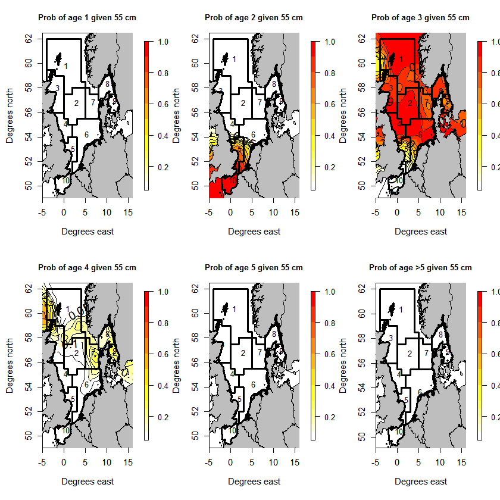
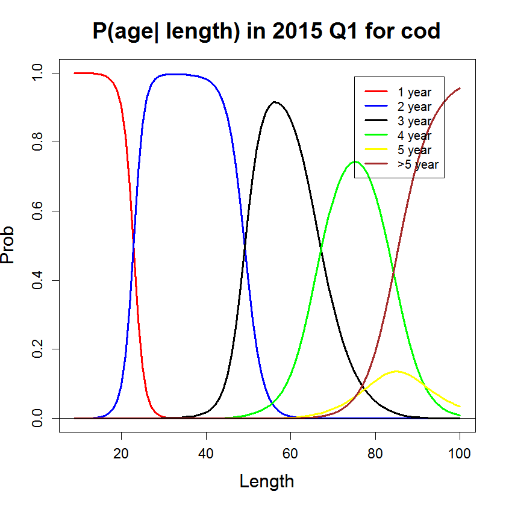

```{r echo=FALSE, eval=TRUE, results='hide',include=FALSE}
library(TMB)
library(mgcv)
library(Matrix)
source("../utils.R")
```


## **Spatial age length key** 
In this case study we apply the SPDE procedure and use P-splines to construct a spatial age length key (ALK).

```{r,echo=FALSE, comment="",fig.cap="Figure: Illustration of the spatial ALK for cod in the North Sea in first quarter in year 2015.", out.width = "400px"}

```

***
#### Description of the practical situation
In this case study we use latent Gaussian random fields and P-splines for modeling ALKs. Data used is the International Bottom Trawl Survey (IBTS) data extracted from [DATRAS](https://datras.ices.dk/Data_products/Download/Download_Data_public.aspx).   Suppose $y(l,{\bf s})$ is the age of a fish with length $l$ caught at location ${\bf s}$, and assume the probability of the fish to be at age $a$ is:
\begin{align}
\pi_a(y(l,{\bf s})) =
\begin{cases}
\frac{\exp(\mu_a)}{1+ \sum_{i = M}^{A-1} \exp(\mu_a)} ,& a<A \\
\frac{1}{1+ \sum_{i = M}^{A-1} \exp(\mu_a)},& a=A
\end{cases},
\label{model}
\end{align}
where 
\begin{align}\label{eq:linearPred}
\mu_a(l,{\bf s}) = \beta_{0,a} + f_a(l)  + \delta_a({\bf s}).
\end{align}
For simplisity we assume independence between years and quarters, and thereby only use data from the year and quarter of interest when estimating the model. Here $f_a(l)$ is a continuous function of length modeled with P-splines, and $\pmb{\delta}$ is a mean zero spatial Gaussian random field with Matern covariance structure. Further is $A$ a defined maximum age, i.e. fish with age larger than $A$ is truncated to have age $A$.


<details> <summary> Summary of data.</summary>
 The data used is extracted from [DATRAS](https://datras.ices.dk/Data_products/Download/Download_Data_public.aspx).
```{r,echo=FALSE, comment=""}
load("cod2015Q1.RData")
head(ca_hh,5)
```
Note that the data from [DATRAS](https://datras.ices.dk/Data_products/Download/Download_Data_public.aspx) comes in three parts with separate information, with an `haul.id` connecting them. Our dataset is constructed by merging these three data sources with the `haul.id`. We have further duplicated rows which describes observations of several fish, information about numbers of fish per row is given by `NoAtALK`. 

The variables used in the model is:

* `LngtCm` is the fish length in cm
* `lon,lat` = $s$ (spatial location)
* `age` is the reponse variable
</details>

***

#### Full code for example
<details> <summary> R code</summary>
```{r,echo=FALSE, comment=""}
include_source("spatialALK.R", linesToInclud=c(1:110))
```
</details>

<details> <summary> C++ code</summary>
```{r,echo=FALSE, comment=""}
include_source("spatialALK.cpp", linesToInclud=c(1:999))
```
</details>


***
#### C++ code step-by-step
<details>  
  <summary>Include libraries </summary>
```c++
  using namespace density; //use GMRF
  using namespace R_inla; //use Q_spde
  using namespace Eigen; //Utilize sparse structures
```
</details>

<details>
  <summary>Read data from R</summary>
```c++
  DATA_VECTOR(age); //The response
  DATA_SPARSE_MATRIX(X); //Design matrix for splines
  DATA_SPARSE_MATRIX(designMatrixForReport); //Design matrix for report of splines
  DATA_VECTOR(Sdims); //Dimensions of penalization matrices
  DATA_INTEGER(antObs); //Number of observation
  DATA_SPARSE_MATRIX(S); //Penalization matrix
  DATA_STRUCT(spde,spde_t); //Three matrices needed for representing the spatial field
  DATA_SPARSE_MATRIX(A);  //Matrix for interpolating points witin triangles
  DATA_INTEGER(flag); // if flag=0 the prior for x is calculated
  DATA_INTEGER(plusGroup); //Age of plus group
```
</details>

<details>
  <summary>Read parameters from R</summary>
```c++
  PARAMETER_VECTOR(beta0); //Intercepts
  PARAMETER_VECTOR(betaLength); //Regression parameters
  PARAMETER_VECTOR(log_lambda); //Penalization parameter
  PARAMETER_VECTOR(x1);//spatial field age 1
  PARAMETER_VECTOR(x2);//spatial field age 2
  PARAMETER_VECTOR(x3);//spatial field age 3
  PARAMETER_VECTOR(x4);//spatial field age 4
  PARAMETER_VECTOR(x5);//spatial field age 5
  PARAMETER(logKappa);//Spatial scale parameter in Matern covariance structures
  PARAMETER(logTau);//Precision parameter in Matern covariance structures
```
</details>

<details>
  <summary>Transform parameters. </summary>
```c++
   Type kappa = exp(logKappa);
   Type tau = exp(logTau);
   vector<Type> lambda = exp(log_lambda);
```
</details>


<details>
  <summary>Extract the precision matrix $Q$ for the GMRF resulting from the SPDE approximation. </summary>
```c++
   SparseMatrix<Type> Q1 = Q_spde(spde,kappa);
   SparseMatrix<Type> Q2 = Q_spde(spde,kappa);
   SparseMatrix<Type> Q3 = Q_spde(spde,kappa);
   SparseMatrix<Type> Q4 = Q_spde(spde,kappa);
   SparseMatrix<Type> Q5 = Q_spde(spde,kappa);
```
</details>

<details>
  <summary>Define the objective function </summary>
```c++
   Type nll = 0;
```
</details>

<details>
  <summary>Add the likelihood contribution from the spatial fields, $\pmb{\delta}_a$ for a = 1,...,5. </summary>
```c++      
  nll += GMRF(Q1,false)(x1)+
  GMRF(Q2,false)(x2)+
  GMRF(Q3,false)(x3)+
  GMRF(Q4,false)(x4)+
  GMRF(Q5,false)(x5);
```
</details>

<details>
  <summary>Calculates the penalization precision matrix for the P-splines </summary>
```c++
  matrix<Type> lambdaDiag(CppAD::Integer(sum(Sdims)),CppAD::Integer(sum(Sdims)));
  lambdaDiag.setZero();
  int counter = 0;
  for(int i =0; i<Sdims.size(); i++){
   for(int j=0; j<Sdims(i); j++){
     lambdaDiag(counter,counter) = lambda(i);
     counter++;
   }
  }
  SparseMatrix<Type> sparse = lambdaDiag.sparseView();
  SparseMatrix<Type> lambdaS = S*sparse;
```
</details>

<details>
  <summary>Add prior of the spline coefficients </summary>
```c++
  nll += GMRF(lambdaS,false)(betaLength);
```
</details>

<details>
  <summary>Return prior on request </summary>
```c++
  if (flag == 0) return nll;
```
</details>

<details>
  <summary>Calculates linear predictors </summary>
```c++
  vector<Type> ageLength = X* betaLength;

  vector<Type> delta1 = (A*x1)/tau;
  vector<Type> delta2 = (A*x2)/tau;
  vector<Type> delta3 = (A*x3)/tau;
  vector<Type> delta4 = (A*x4)/tau;
  vector<Type> delta5 = (A*x5)/tau;

  vector<Type> nu1 = exp(beta0(0) + ageLength.segment(0,antObs)+  delta1);
  vector<Type> nu2 = exp(beta0(1) + ageLength.segment(antObs,antObs)+  delta2);
  vector<Type> nu3 = exp(beta0(2) + ageLength.segment(2*antObs,antObs)+  delta3);
  vector<Type> nu4 = exp(beta0(3) + ageLength.segment(3*antObs,antObs)+  delta4);
  vector<Type> nu5 = exp(beta0(4) + ageLength.segment(4*antObs,antObs)+  delta5);
```
</details>

<details>
  <summary>Calculates the likelihood contribution from the observations </summary>
```c++
  vector<Type> prob(plusGroup+1);
  Type sum;
  for(int i=0;i<antObs; ++i){

    sum = nu1(i) + nu2(i) + nu3(i) + nu4(i)+ nu5(i);
    prob(1) = nu1(i)/(1+sum);
    prob(2) = nu2(i)/(1+sum);
    prob(3) = nu3(i)/(1+sum);
    prob(4) = nu4(i)/(1+sum);
    prob(5) = nu5(i)/(1+sum);
    prob(6) = 1/(1+sum);

    nll += -log(prob(CppAD::Integer(age(i))));
  }
```
</details>


<details>
  <summary> Report splines.  </summary>
```c++
  vector<Type> repLength = designMatrixForReport* betaLength;
  ADREPORT(repLength);
```
</details>

<details>
<summary>Return the objective function </summary>
```c++
  return nll;
```
</details>

***

#### R code step-by-step
<details>  
  <summary>Include libraries</summary>
```r
  library(TMB)
  library(INLA) #Use SPDE functionality
  library(rgdal) #use readOGR
  library(mgcv) #Use spline functionality
  library(maptools) #use pointLabel()
  library(fields) #use image.plot()
  library(rworldxtra) #Use dataset for ploting
```
</details>

<details>  
  <summary>Compile and load the C++ code</summary>
```r
  compile("spatialALK.cpp")
  dyn.load(dynlib("spatialALK"))
```
</details>

<details>  
  <summary>Read data</summary>
```r
  load("cod2015Q1.RData")
  plusGroup = 6;
  
  polygons <- readOGR("Roundfish_shapefiles")
  data(countriesHigh)
  map <- countriesHigh
```
</details>

<details>  
  <summary>Set up splines</summary>
```r
  gam_setup = gam(Age ~ s(LngtCm, bs = "cs"),
                  data = ca_hh,fit=FALSE)
  
  #Penelization matrix
  S = gam_setup$smooth[[1]]$S[[1]]
  S_list = list(rep(list(S),plusGroup-1))[[1]]
  S_combined = .bdiag(S_list)         # join S's in sparse matrix
  Sdims = unlist(lapply(S_list,nrow)) # Find dimension of each S
  
  #Design matrix
  X_list = list(rep(list(gam_setup$X[,-1]),plusGroup-1))[[1]]
  
  #For report
  LngtCm=seq(min(ca_hh$LngtCm),100,by = 1)
  lengthReport = PredictMat(gam_setup$smooth[[1]],data = data.frame(LngtCm))
  lengthReport_list = list(rep(list(lengthReport),plusGroup-1))[[1]]
```
</details>

<details>  
  <summary>Set up SPDE</summary>
```r
  #Extract the locations and convert to UTM-coordinates
  n = dim(ca_hh)[1]
  XY = data.frame(ca_hh$lon, ca_hh$lat)
  names(XY) = c("X","Y")
  
  UTMcenter = 31
  latLon = SpatialPoints(XY, proj4string = CRS(as.character(NA)))
  proj4string(latLon) ="+proj=longlat"
  XYUTM= spTransform(latLon,paste("+proj=utm +",UTMcenter,"V +units=km",sep = ""))
  
  cutoff = 50
  maxEdge = c(100,140)
  points = matrix(0,n,2)
  points[,1] = XYUTM$X
  points[,2] = XYUTM$Y
  boundary = INLA::inla.nonconvex.hull(points)
  boundary2 = INLA::inla.nonconvex.hull(points,convex = -0.45)
  mesh = INLA::inla.mesh.2d(loc = points, boundary = list(boundary,boundary2),max.edge = maxEdge,cutoff = cutoff)
  A = inla.spde.make.A(mesh,points)
  spde = INLA::inla.spde2.matern(mesh = mesh , alpha = 2)#Defines the parts needed in the precision matrix
```
</details>

<details>  
  <summary> Construct the data list which is given to TMB (C++)</summary>
```r
  data = list(
    age = ca_hh$Age,
    antObs = length(ca_hh$Age),
    length = ca_hh$LngtCm,
    Sdims = Sdims,
    S = S_combined,
    X = .bdiag(X_list), # Design matrix, without intercept
    designMatrixForReport = .bdiag(lengthReport_list),
    A =  A,
    spde = spde$param.inla[c("M0","M1","M2")],
    plusGroup = plusGroup
  )
```
</details>

<details>  
  <summary> Construct the parameter list with initial values which is given to TMB (C++)</summary>
```r
  parameters <- list(
    beta0 = rep(0,plusGroup-1),
    betaLength = rep(0,dim(S)[1]*(plusGroup-1)),
    log_lambda = rep(0,plusGroup-1),
    x1 = rep(0,mesh$n),
    x2 = rep(0,mesh$n),
    x3 = rep(0,mesh$n),
    x4 = rep(0,mesh$n),
    x5 = rep(0,mesh$n),
    logKappa = -4,
    logTau = 4
  )
```
</details>

<details>  
  <summary> Fit the model</summary>
```r
  data$flag = 1
  obj <- TMB::MakeADFun(data,parameters,
                        random = c("x1","x2","x3","x4","x5", "betaLength"),
                        DLL = "spatialALK")
  obj <- normalize(obj, flag="flag")
  opt<-stats::nlminb(obj$par,obj$fn,obj$gr,
                     control = list(iter.max = 300,
                                    eval.max = 300))
  rep<-TMB::sdreport(obj, getJointPrecision=TRUE)
```
</details>


***
#### Exercise


1. 
<details>  
  <summary> Fit the model and extract ALK when spatial fields equal zero.</summary>
```r
  index = which(names(rep$value)=="repLength")
  muSpline1 = exp(rep$par.fixed[1] + rep$value[index[1:dim(lengthReport)[1]]]) 
  muSpline2 = exp(rep$par.fixed[2] + rep$value[index[(dim(lengthReport)[1]+1):(2*dim(lengthReport)[1])]])
  muSpline3 = exp(rep$par.fixed[3] + rep$value[index[(2*dim(lengthReport)[1]+1):(3*dim(lengthReport)[1])]]) 
  muSpline4 = exp(rep$par.fixed[4] + rep$value[index[(3*dim(lengthReport)[1]+1):(4*dim(lengthReport)[1])]]) 
  muSpline5 = exp(rep$par.fixed[5] + rep$value[index[(4*dim(lengthReport)[1]+1):(5*dim(lengthReport)[1])]]) 
  sum = muSpline1 + muSpline2 + muSpline3 + muSpline4 + muSpline5
  prob1 = muSpline1/(1 + sum)
  prob2 = muSpline2/(1 + sum)
  prob3 = muSpline3/(1 + sum)
  prob4 = muSpline4/(1 + sum)
  prob5 = muSpline5/(1 + sum)
  prob6 = 1/(1+sum)
  plot(LngtCm,prob1 ,
       ylim = c(0,1),
       xlab = "Length", ylab = "Prob", main = "P(age| length) in 2015 Q1 for cod",
       lwd=3, col="red",type = 'l',
       cex.lab=1.5, cex.main = 1.8,cex.axis = 1.2)
  lines(LngtCm,prob2 ,
        ylim = c(0,1),
        lwd=3, col="blue",type = 'l')
  lines(LngtCm,prob3 ,
        ylim = c(0,1),
        lwd=3, col="black",type = 'l')
  lines(LngtCm,prob4 ,
        ylim = c(0,1),
        lwd=3, col="green",type = 'l')
  lines(LngtCm,prob5 ,
        ylim = c(0,1),
        lwd=3, col="yellow",type = 'l')
  lines(LngtCm,prob6 ,
        ylim = c(0,1),
        lwd=3, col="brown",type = 'l')
  abline(h=0)
  legend(x=75,y=0.99,legend = c("1 year","2 year","3 year","4 year","5 year",">5 year")
     ,col=c("red","blue","black","green","yellow","brown"),lty = 1,lwd = 3)
```
```{r,echo=FALSE, comment="",fig.cap="Figure: ALK given zero spatial effect.", out.width = "300px"}
  
```
</details>

2. 
<details>  
  <summary>Plot spatial ALK for a 55 cm long cod.</summary>
```r
  index = which(names(rep$value)=="repLength")
  muSpline1 = exp(rep$par.fixed[1] + rep$value[index[1:dim(lengthReport)[1]]]) 
  muSpline2 = exp(rep$par.fixed[2] + rep$value[index[(dim(lengthReport)[1]+1):(2*dim(lengthReport)[1])]])
  muSpline3 = exp(rep$par.fixed[3] + rep$value[index[(2*dim(lengthReport)[1]+1):(3*dim(lengthReport)[1])]]) 
  muSpline4 = exp(rep$par.fixed[4] + rep$value[index[(3*dim(lengthReport)[1]+1):(4*dim(lengthReport)[1])]]) 
  muSpline5 = exp(rep$par.fixed[5] + rep$value[index[(4*dim(lengthReport)[1]+1):(5*dim(lengthReport)[1])]]) 
  sum = muSpline1 + muSpline2 + muSpline3 + muSpline4 + muSpline5
  prob1 = muSpline1/(1 + sum)
  prob2 = muSpline2/(1 + sum)
  prob3 = muSpline3/(1 + sum)
  prob4 = muSpline4/(1 + sum)
  prob5 = muSpline5/(1 + sum)
  prob6 = 1/(1+sum)
  plot(LngtCm,prob1 ,
       ylim = c(0,1),
       xlab = "Length", ylab = "Prob", main = "P(age| length) in 2015 Q1 for cod",
       lwd=3, col="red",type = 'l',
       cex.lab=1.5, cex.main = 1.8,cex.axis = 1.2)
  lines(LngtCm,prob2 ,
        ylim = c(0,1),
        lwd=3, col="blue",type = 'l')
  lines(LngtCm,prob3 ,
        ylim = c(0,1),
        lwd=3, col="black",type = 'l')
  lines(LngtCm,prob4 ,
        ylim = c(0,1),
        lwd=3, col="green",type = 'l')
  lines(LngtCm,prob5 ,
        ylim = c(0,1),
        lwd=3, col="yellow",type = 'l')
  lines(LngtCm,prob6 ,
        ylim = c(0,1),
        lwd=3, col="brown",type = 'l')
  abline(h=0)
  legend(x=75,y=0.99,legend = c("1 year","2 year","3 year","4 year","5 year",">5 year")
     ,col=c("red","blue","black","green","yellow","brown"),lty = 1,lwd = 3)
```
```{r,echo=FALSE, comment="",fig.cap="Figure: Illustration of spatial ALK for cod in the North Sea in fist quarter in year 2015 .", out.width = "400px"}
  
```
</details>

