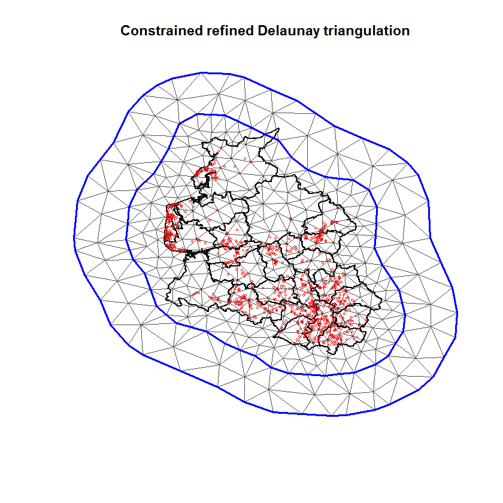
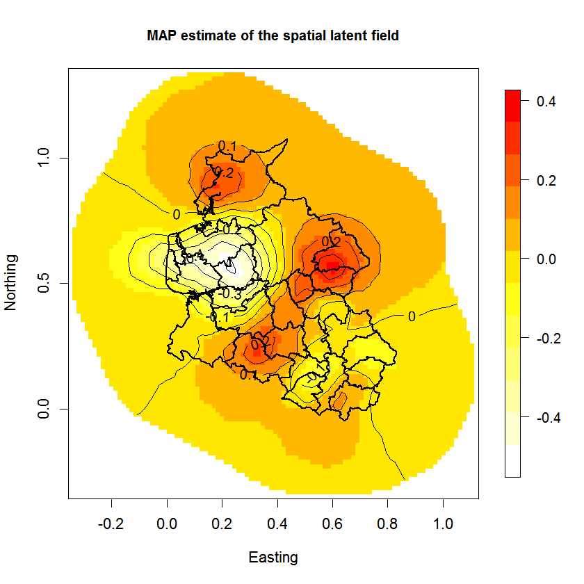
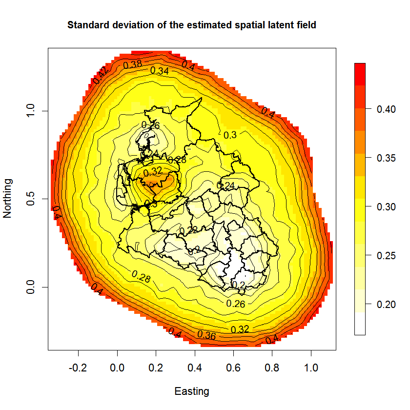
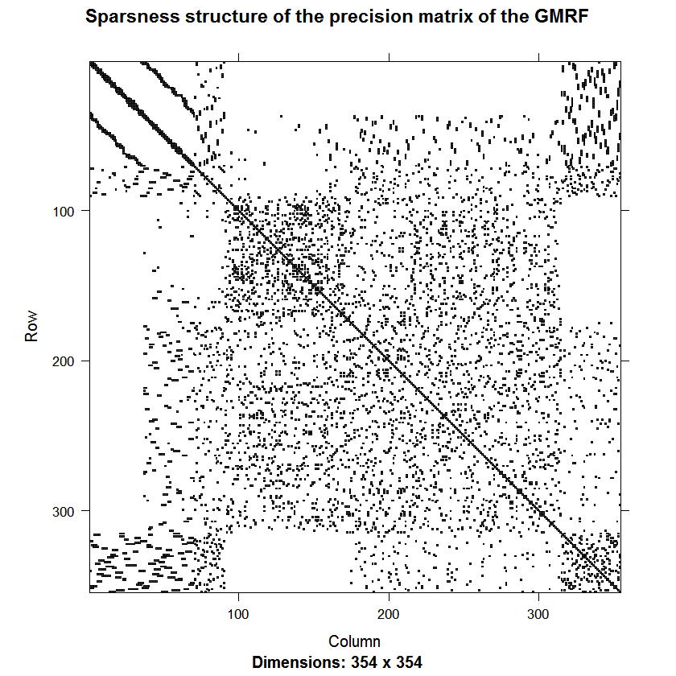

```{r echo=FALSE, eval=TRUE, results='hide',include=FALSE}
library(TMB)
library(mgcv)
library(Matrix)
source("../utils.R")
```


## **Spatial modeling with (approximate) Matern covariance functions** 
In this example you learn:

* How to use the SPDE approximation of a Matern spatial random field in TMB
* How to set up the triangularization (mesh) of the spatial region in R-INLA and import it into TMB
* Reduce computation times and memory use by avoid to evaluate the normalizing constant of `GMRF()`

```{r,echo=FALSE, comment="",fig.cap="Figure: Mesh set up in R-INLA,  used for the GMRF representation in TMB. The red dots illustrate the observation locations.", out.width = "300px"}

```

***
#### Description of the practical situation
In this case study we use a latent Gaussian random field to model survival times of leukemia patients in north-west England. Assume that the survival time $T$ for a leukemia patient is Weibull distributed with survival probablity given by $P(T\geq t)=\exp(-\eta t^\omega)$. Here,
\begin{align}
\pmb{\eta} = \beta_0 + \beta_{\text{sex}}\textbf{sex} +  \beta_{\text{age}}\textbf{age} +  \beta_{\text{wbc}}\textbf{wbc} +  \beta_{\text{tpi}}\textbf{tpi} +  \pmb{\delta}
\end{align}
is a linear predictor (vector) linking the response to covariates.
In addition, the patients are followed for a certain period of time, and if a patient leaves the study the patient is *censored*. In such cases we only know that the patient has survived up to time of censoring, a common situation in survival analysis. 

<details> <summary> Details about the spatial component $\pmb{\delta}$. </summary> 

The starting point is a continuously indexed Matern process $\delta(s)$, where $s$ is the spatial location. In the SPDE approach we only need to represent $\delta(s)$ in the grid nodes of the mesh
(see figure above), yielding the vector $\pmb{\delta}$.  It is assumed that $\pmb{\delta} \sim N(\pmb{0},\pmb{\Sigma})$, where $\pmb{\Sigma}$ is a Matern covariance matrix. In this case study it is inference about $\pmb{\delta}$ that is of interest. We will model $\pmb{\delta}$ by utilizing that it can be approximated with a Gaussian Markov random field (GMRF). Since we approximate it with a GMRF we need to define a mesh overlaying the area of interest. We use the R-package INLA to construct this mesh along with the sparse precision matrix representing the GMRF. See the figure above for an illustration of the mesh.
    
</details>

<details> <summary> Summary of data.</summary>
The data is the same used in the Laukemia example in Lindgren et al. (2011). https://rss.onlinelibrary.wiley.com/doi/epdf/10.1111/j.1467-9868.2011.00777.x
```{r,echo=FALSE, comment=""}
data(Leuk,package = "INLA")
head(Leuk,5)
```
* `time` is the survival time (or time until censoring)
* `cens` is a censoring indicator taking the value 0 in case of censoring and 
    1 if not. To clarify, we call this `notcens` in the C++ program.
* `xcoord,ycoord` = $s$ (spatial location)
* Remaining variables are covariates.
</details>

***

#### Full code for example
<details> <summary> R code</summary>
```{r,echo=FALSE, comment=""}
include_source("spde.R", linesToInclud=c(1:55))
```
</details>
<details> <summary> C++ code</summary>
```{r,echo=FALSE, comment=""}
include_source("spde.cpp", linesToInclud=c(1:999))
```
</details>


***
#### C++ code step-by-step
<details>  
  <summary>Include libraries </summary>
```c++
  using namespace R_inla; // Includes SPDE-spesific functions, e.g. Q_spde()
  using namespace density; 
  using namespace Eigen; // Needed for utilisation of sparse matrices
```
</details>
<details>
  <summary>Read data from R</summary>
```c++
  DATA_VECTOR(time);      //The response
  DATA_IVECTOR(notcens);  //indicator vector stating which persons that were censored
  DATA_MATRIX(X);         //Design matrix for fixed effects
  DATA_STRUCT(spdeMatrices,spde_t); //Three matrices needed for representing the GMRF, see p. 8 in Lindgren et al. (2011)
  DATA_SPARSE_MATRIX(A);  //Matrix for interpolating points witin triangles 
```
</details>

<details>
  <summary>Read parameters from R</summary>
```c++
  PARAMETER_VECTOR(beta);      
  PARAMETER(log_tau);
  PARAMETER(log_kappa);
  PARAMETER(log_omega);  
  PARAMETER_VECTOR(x);  
```
</details>

<details>
  <summary>Transform some of the parameters. </summary>
```c++
  Type tau = exp(log_tau); // Parameter in the Matern covariance function
  Type kappa = exp(log_kappa);// Parameter in the Matern covariance function
  Type omega = exp(log_omega);  // Parameter of Weibull distribution
```
</details>

<details>
  <summary>Spatial interpolation</summary>
```c++
  vector<Type> delta = (A*x)/tau;
```
* `x` is the value of the random field at the mesh nodes (see figure),
while `delta` is the value at the observation locations.
* We use `x` as our latent variable, to which the Laplace approximation is applied.
* `A` is a spatial interpolation matrix set up in R-INLA.
* Note in addition that `x` is "unscaled", i.e. its distribution does not depend on the precision paramater `tau`.
</details>

<details>
  <summary>Extract the precission matrix $Q$ for the GMRF resulting from the SPDE approximation. </summary>
```c++
  SparseMatrix<Type> Q = Q_spde(spdeMatrices,kappa);
```
This code line evaluates eqn (10) in Lindgren et al (2011), with $\alpha=2$. It combines the sparse matrices $C$ and $G$ (stored in `spdeMatrices`) in the paper with the parameter `kappa`. Due to the dependence on `kappa` the resulting matrix $Q$ must be built on the  C++ side (not in R). 
</details>

<details>
  <summary>Define the objective function 
  $\text{nll}=-\left(\log P(\text{data}|\pmb{\beta}, \pmb{\delta},\pmb{\omega}) + \log P(\pmb{\delta}|\kappa,\tau)\right)$. </summary>
```c++
  Type nll=0; //negative log-likelihood
```
</details>

<details>
  <summary>Add the likelihood contribution from the Markov random field $(\pmb{\delta})$: $P(\pmb{\delta}|\kappa,\tau)$ </summary>
```c++
  nll = GMRF(Q)(x);       
```

* `GMRF()` is part of the `density` namespace in TMB, and hence returns
  the *negative* log density of the multivariate normal density with
  precision matrix $Q$, evaluated at $x$.
* You may be surprised to find `GMRF(Q)(x)` instead of `GMRF(Q)(delta)` here. The reason is that we are working
internally with `x` instead of `delta` as noted above.
</details>

<details>
  <summary>Calculates the linear predictor </summary>
```c++
  vector<Type> eta = X*beta + delta;
```
</details>

<details>
  <summary>Calculates the likelihood contribution from the observations </summary>
```c++
  for(int i=0; i<time.size(); i++){         // Loop over observations   
    Type lambda = exp(eta(i));
    Type t_omega = pow(time(i),omega);      // Temporary variable
    Type S = exp(-lambda*t_omega);          // Survival probability
    Type f = lambda*omega*t_omega/time(i)*S;// Weibull density
    if(notcens(i)){
      nll -= log(f);
    }else{
      nll -= log(S);        //The patient survived until cencoring
    }
  }
```

* This implements the censored Weibull density. Details do
not matter if you are only interested in the SPDE stuff.
</details>


<details>
  <summary> Calculates "spatial range" and reports back to R.  </summary>
```c++
  Type range = sqrt(8)/kappa;  //Distance at which correlation has dropped to 0.1, see p. 4 in Lindgren et al. (2011)
  ADREPORT(range);      // Report point estimate and SD to R
  ADREPORT(x);
```
</details>

<details>
<summary>Return the objective function </summary>
```c++
  return nll;
```
</details>

***

#### R code step-by-step
<details>  
  <summary>Include libraries</summary>
```r
  library(TMB)
  library(INLA)
  library(fields)
```
</details>

<details>  
  <summary>Compile and load the C++ code</summary>
```r
  compile("spde.cpp")
  dyn.load(dynlib("spde"))
```
</details>

<details>  
  <summary>Read data</summary>
```r
  map = read.table("Leuk.map")  # So that we plot the map in the figure
  data(Leuk,package = "INLA")   # Get data set
```
</details>

<details>  
  <summary>Construct the mesh needed to define GMRF</summary>
```r
  loc = cbind(Leuk$xcoord, Leuk$ycoord)
  boundary = INLA::inla.nonconvex.hull(loc)
  boundary2 = INLA::inla.nonconvex.hull(loc,convex = -0.35)
  mesh = INLA::inla.mesh.2d(
    loc=loc,
    boundary = list(boundary,boundary2),
    max.edge=c(0.05, 0.2),
    cutoff=0.05
  )
```

* Familiarity with R-INLA is needed to understand this code.
</details>

<details>  
  <summary>Construct spatial interpolation matrix that relates `x` to `delta`</summary>
```r
  A = inla.spde.make.A(mesh,loc)
```
</details>

<details>  
  <summary>Extract the matrices needed for calculating the sparse precision matrix representing the GMRF</summary>
```r
  spde = inla.spde2.matern(mesh, alpha=2)
  spdeMatrices = spde$param.inla[c("M0","M1","M2")]
```

* `M0`, `M1` and`M2` are R-INLA's internal representation of 
the sparse matrices $C$ and $G$ in Lindgren et al.
</details>

<details>  
  <summary> Calculate the fixed effect design matrix</summary>
```r
  X <- model.matrix( ~ 1 + Leuk$sex + Leuk$age + Leuk$wbc + Leuk$tpi, data = Leuk)
```
</details>

<details>  
  <summary> Construct the data list which is given to TMB (C++)</summary>
```r
  data <- list(time       = Leuk$time,
               notcens    = Leuk$cens,
               meshidxloc = mesh$idx$loc - 1,
               A          = A,
               X          = as.matrix(X),
               spdeMatrices = spdeMatrices
               )
```
</details>

<details>  
  <summary> Construct the parameter list with initial values which is given to TMB (C++)</summary>
```r
  parameters <- list(beta      = c(0.0,0,0,0,0),
                     log_tau   = 0,
                     log_kappa = 0,
                     log_omega = -1,
                     x         = rep(0.0, nrow(data$spdeMatrices$M0)) )
```

* Note that numerical minimization routines such as `nlminb` can be sensitive to the staring values for `log_tau` and `log_kappa`.
</details>

<details>  
  <summary> Fit the model</summary>
```r
  obj <- MakeADFun(data, parameters, random="x", DLL="spde")
  opt <- nlminb(obj$par, obj$fn, obj$gr)
```
</details>


***
#### Exercise


1. 
<details>  
  <summary> Fit the model and extract the standard deviations returned by TMB.</summary>
```r
  obj <- MakeADFun(data, parameters, random="x", DLL="spde")
  opt <- nlminb(obj$par, obj$fn, obj$gr)
  rep <- sdreport(obj)
```
</details>
2. 
<details>  
  <summary> Plot the MAP (maximum a posteriori probability) estimate of the GMFR.</summary>
```r
  proj = inla.mesh.projector(mesh)
  latentFieldMAP = rep$par.random[names(rep$par.random)=="x"]/exp(rep$par.fixed[which(names(rep$par.fixed)=="log_tau")])
  image.plot(proj$x,proj$y, inla.mesh.project(proj, latentFieldMAP),col =  colorRampPalette(c("white","yellow", "red"))(12),
             xlab = 'Easting', ylab = 'Northing',
             main = "MAP estimate of the spatial latent field",
             cex.lab = 1.1,cex.axis = 1.1, cex.main=1, cex.sub= 1.1)
  contour(proj$x, proj$y,inla.mesh.project(proj, latentFieldMAP) ,add = T,labcex  = 1,cex = 1)
  points(map,type = 'l',lwd = 2)
```
    
</details>
3. 
<details>  
  <summary> Plot the estimated standard deviation of the GMFR.</summary>
```r
  latentFieldSD = sqrt(rep$diag.cov.random)/exp(rep$par.fixed[which(names(rep$par.fixed)=="log_tau")])
  image.plot(proj$x,proj$y, inla.mesh.project(proj, latentFieldSD),col =  colorRampPalette(c("white","yellow", "red"))(12),
             xlab = 'Easting', ylab = 'Northing',
             main = "Standard deviation of the estimated spatial latent field",
             cex.lab = 1.1,cex.axis = 1.1, cex.main=1, cex.sub= 1.1)
  contour(proj$x, proj$y,inla.mesh.project(proj, latentFieldSD) ,add = T,labcex  = 1,cex = 1)
  points(map,type = 'l',lwd = 2)
```
    

</details>

4. 
<details>
  <summary> Inspect the sparseness structure of the precision matrix of the GMRF.</summary>
    Sparse structures in the precision matrix are used for fast calculation of the Laplace approximation. We will now construct an image plot of the precision matrix which illustrates the sparsity.
    
    First we need to report the joint precisions matrix, this is done by including getJointPrecision=TRUE in the sdreport() call.
    
    ```r
      rep <- sdreport(obj,getJointPrecision=T)
    ```
    
    We can then extract the precision matrix and illustrate the sparseness with image(). 
    
    ```r
      library(SparseM)
      nameIndex = which(colnames(rep$jointPrecision)=="x")
      Q = rep$jointPrecision[nameIndex,nameIndex]
      Q[Q!=0] = 1           # We are not interested in the value of the elements, only if they are 0 or not
      image(Q, main = "Sparsness structure of the precision matrix of the GMRF")
    ```
    {width=350px}


</details>

5. 
<details><summary> Reduce *computation times* and *memory use* by avoid to evaluate the normalizing constant of the spatial prior. A large part of the computation of `GMFR(Q)` is the normalizing 
  constant $\det(Q)$ of the multivariate normal distribution. For large models is advantageous to move this computation from C++ to R.
Hint: `spde.R` and `spde.cpp`  contains code (commented out) the necessary changes. Do a search for "flag" in both files to locate the needed code. Read the help page `?normalize` to understand
what is going on.
  </summary> 
  <b>Details</b> and   <b>implementation</b>:
  TMB evaluates the C++ template for different purposes. For instance in the "inner optimization" the objective function is only minimized as a function of the latent variables `x` (for given 
  values of the remaining parameters). Hence it is not necessary to calculate $\det(Q)$, which you can achieve by the  following change:
```c++
      //nll = GMRF(Q)(x);                             
      nll = GMRF(Q, false)(x); //Do not calculate the normlizing constant det(Q)
```
However, when we evaluate  the Laplace approximation of the marginal likelihood, we do need $\det(Q)$ to be included. It turns out that calculating $\det(Q)$ on the R side consumes less
memory  (related to AD) for these types of models. 
A high-level pseudo-code for the C++ part of this example is
```c++
      nll = GMRF(Q, false)(x); // SPDE prior on x
      nll -= sum(dweibull_censored(time,notcens,...,x,...))   // Pseudo-code for all the Weibull related code
```
where the second line is pseudo-code for the (data dependent) likelihood part.
To allow R to figure out the value of $\det(Q)$ is, we
need to calculate the objective function *without*  the second line, i.e. only with
`nll = GMRF(Q, false)(x)`. This can be achieved via a "premature return" from the function,
controlled by the variable `flag` that we set on the R side:
```c++
  nll = GMRF(Q, false)(x);
  if (flag == 0) return nll;  // Returning  prematurely without adding Weibull contribution to objective function
  nll -= sum(dweibull_censored(time,notcens,...,x,...))   
```
</details>
