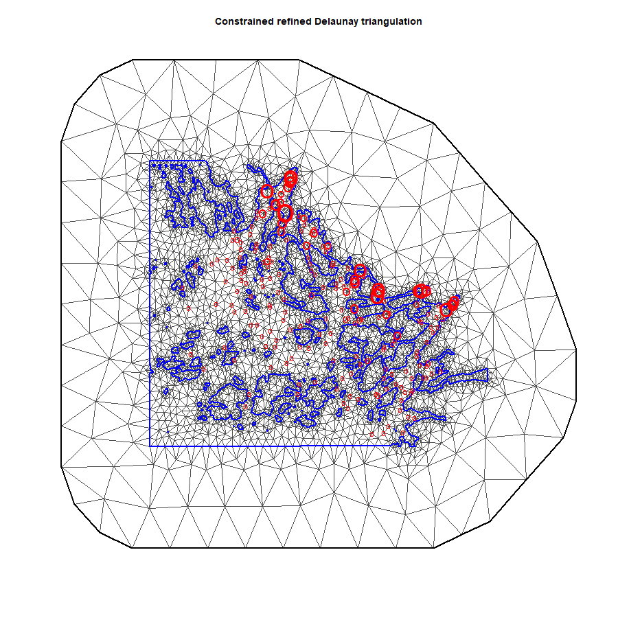
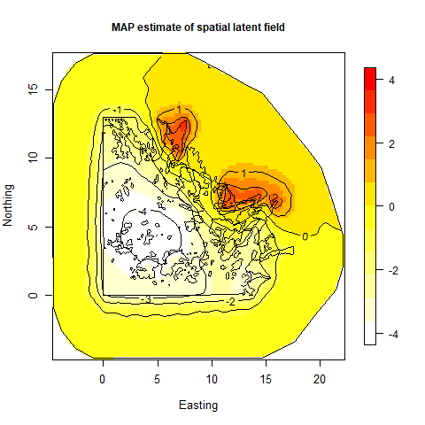
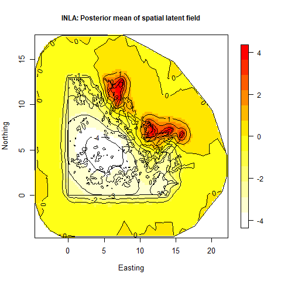
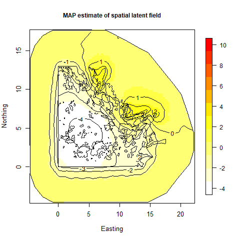
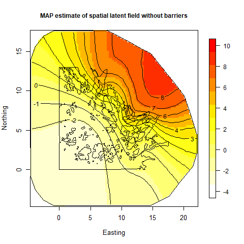

```{r echo=FALSE, eval=TRUE, results='hide',include=FALSE}
library(INLA)
library(fields)
library(TMB)
source("../utils.R")
```


## **Spatial modeling with (approximate) Matern covariance function with barriers** 
In this example you learn:

* How to use the SPDE approximation of a Matern spatial random field with barriers in TMB

```{r,echo=FALSE, comment="",fig.cap="Figure: Mesh set up in R-INLA,  used for the GMRF representation in TMB. Blue polygons illustrate coastline and boundary, and red points illustrate observations and observation size.", out.width = "500px"}

```

***
#### Description of the practical situation
In this case study we fit the fish larvea distribution model providede in
[Bakka et al. (2016)](https://www.researchgate.net/publication/306187253_Accounting_for_Physical_Barriers_in_Species_Distribution_Modeling_With_Non-Stationary_Spatial_Random_Effects). The number of larvea, $y_i$ caught at location ${\bf s}_i$ is assumed to be distributed as
\begin{align}
y_i \sim \text{Poisson}(\eta_i)
\end{align}
where
\begin{align}
\log \eta_i =  X \pmb{\beta} + \delta({\bf s}_i) + \epsilon_i.
\end{align}
Here ${\bf X}$ is a design matrix for the fixed effects, $\pmb{\beta}$ is a vector with the covariate regression coefficients, $\pmb{\delta}$ is a latent spatial field with Matern covariance structure with barrieres, and $\pmb{\epsilon}$ is iid Gaussian distributed. It is the spatial effect $\pmb{\delta}$ which is of interest in this case study. Note that we do not use the priors included in [Bakka et al. (2016)](https://www.researchgate.net/publication/306187253_Accounting_for_Physical_Barriers_in_Species_Distribution_Modeling_With_Non-Stationary_Spatial_Random_Effects). 


See https://haakonbakkagit.github.io/btopic128.html#3_case_study for the same case study with use of R-INLA.

***

#### Full code for example
<details> <summary> R code</summary>
```{r,echo=FALSE, comment=""}
include_source("spdeBarrier.R", linesToInclud=c(1:999))
```
</details>
<details> <summary> C++ code</summary>
```{r,echo=FALSE, comment=""}
include_source("spdeBarrier.cpp", linesToInclud=c(1:999))
```
</details>


***
#### C++ code step-by-step
<details>  
  <summary>Include libraries </summary>
```c++
  using namespace R_inla; // Includes SPDE-spesific functions, e.g. Q_spde()
  using namespace density; 
  using namespace Eigen; // Needed for utilisation of sparse matrices
```
</details>
<details>
  <summary>Read data from R</summary>
```c++
  DATA_VECTOR(y);      //The response
  DATA_STRUCT(spdeMatricesBarrier,spde_b); //Structure needed for the barrier procedure
  DATA_SPARSE_MATRIX(A);  //Matrix for interpolating points witin triangles
  DATA_VECTOR(c);      // Scaling of range
  DATA_MATRIX(X);         //Design matrix for fixed effects
```
</details>

<details>
  <summary>Read parameters from R</summary>
```c++
  PARAMETER_VECTOR(beta); //Regresion coefficients for intercept and covariates
  PARAMETER(log_tau); //log precision for spatial effect
  PARAMETER(log_kappa); //log spatial scale parameter in spatial effect
  PARAMETER(log_sigmaIID); //log standard deviation in iid effect
  PARAMETER_VECTOR(x); //Spatial effect
  PARAMETER_VECTOR(xiid);  //Iid effect
```
</details>

<details>
  <summary>Transform some of the parameters. </summary>
```c++
  Type tau = exp(log_tau);
  Type kappa = exp(log_kappa);
  Type sigmaIID = exp(log_sigmaIID);
```
</details>

<details>
  <summary>Spatial interpolation</summary>
```c++
  vector<Type> delta = (A*x)/tau;
```
* `x` is the value of the random field at the mesh nodes (see figure),
while `delta` is the value at the observation locations.
* We use `x` as our latent variable, to which the Laplace approximation is applied.
* `A` is a spatial interpolation matrix set up in R-INLA.
* Note in addition that `x` is "unscaled", i.e. its distribution does not depend on the precision paramater `tau`.
</details>

<details>
  <summary>Extract the precission matrix $Q$ for the GMRF resulting from the SPDE approximation. </summary>
```c++
  SparseMatrix<Type> Q;
  Q = Q_spde(spdeMatricesBarrier,kappa,c);
```
</details>

<details>
  <summary>Define the objective function 
  $\text{nll}=-\left(\log P(\text{data}|\pmb{\beta}, \pmb{\delta},\pmb{\epsilon}) + \log P(\pmb{\delta}|\kappa,\tau)+ \log P(\pmb{\epsilon}|\sigma_{\epsilon})\right)$. </summary>
```c++
  Type nll=0; //negative log-likelihood
```
</details>

<details>
  <summary>Add the likelihood contribution from the Markov random field: $P(\pmb{\delta}|\kappa,\tau)$ </summary>
```c++
  nll = GMRF(Q)(x);       
```

* `GMRF()` is part of the `density` namespace in TMB, and hence returns
  the *negative* log density of the multivariate normal density with
  precision matrix $Q$, evaluated at $x$.
* You may be surprised to find `GMRF(Q)(x)` instead of `GMRF(Q)(delta)` here. The reason is that we are working
internally with `x` instead of `delta` as noted above.
</details>


<details>
  <summary>Likelihood contribution by iid effect: $P(\pmb{\epsilon}|\sigma_{\epsilon})$ </summary>
```c++
  for(int i =0; i< y.size(); ++i){
    nll-= dnorm(xiid(i), Type(0), sigmaIID,true);
  }
```
</details>

<details>
  <summary>Calculates the linear predictor </summary>
```c++
  vector<Type> eta = exp(X*beta + delta + xiid);
```
</details>

<details>
  <summary>Calculates the likelihood contribution from the observations: $P(\pmb{\text{data}}|\pmb{\beta},\pmb{\delta},\pmb{\epsilon})$ </summary>
```c++
  for(int i=0; i<y.size(); i++){
    nll -= dpois(y(i), eta(i),true);
  }
```
</details>


<details>
  <summary>Calculates "spatial range" and reports back to R.  </summary>
```c++
  Type range = sqrt(8)/kappa;  //Distance at which correlation has dropped to 0.1, see p. 4 in Lindgren et al. (2011)
  ADREPORT(range);      // Report point estimate and SD to R
  ADREPORT(x);
```
</details>

<details>
<summary>Return the objective function </summary>
```c++
  return nll;
```
</details>

***

#### R code step-by-step
<details>  
  <summary>Include libraries</summary>
```r
  library(TMB)
  library(INLA)
  library(fields)
```
</details>

<details>  
  <summary>Compile and load the C++ code</summary>
```r
  compile("spdeBarrier.cpp")
  dyn.load("spdeBarrier")
```
</details>

<details>  
  <summary>Download and read data</summary>
```r
  download.file(url = "https://haakonbakka.bitbucket.io/data/WebSiteData-Archipelago.RData", destfile = "WebSiteData-Archipelago.RData")
  load(file = "WebSiteData-Archipelago.RData")
```
</details>

<details>  
  <summary>Construct the mesh needed to define GMRF</summary>
```r
  mesh = inla.mesh.2d(boundary = poly.water,
                      loc=cbind(df$locx, df$locy),
                      max.edge = c(1,5)*0.6,
                      cutoff = 0.06,
                      offset = c(0.6, 4.6))
```

* Familiarity with R-INLA is needed to understand this code.
</details>

<details>  
  <summary>Construct spatial interpolation matrix that relates `x` to `delta`</summary>
```r
  A = inla.spde.make.A(mesh, loc = cbind(df$locx, df$locy))
```
</details>

<details>  
  <summary>Find barrier triangles</summary>
```r
  tl = length(mesh$graph$tv[,1])
  posTri = matrix(0, tl, 2)
  for(t in 1:tl){
    temp = mesh$loc[mesh$graph$tv[t, ], ]
    posTri[t,] = colMeans(temp)[c(1,2)]
  }
  posTri = SpatialPoints(posTri)
  normal = unlist(over(poly.water, posTri, returnList=T))
  barrier.triangles = setdiff(1:tl, normal)
```
</details>


<details>  
  <summary>Extract the matrices needed for calculating the sparse precision matrix representing the GMRF</summary>
```r
  fem = INLA:::inla.barrier.fem(mesh = mesh, barrier.triangles = barrier.triangles)
  spdeMatricesBarrier = list(C0 = fem$C[[1]],C1 =fem$C[[2]] ,D0 = fem$D[[1]],D1 = fem$D[[2]],I = fem$I ) 
```
</details>

<details>  
  <summary> Calculate the fixed effect design matrix</summary>
```r
X <- model.matrix( ~ 1,
                   data = df) #No covariates
```
* Only intercept is used in this example.
</details>

<details>  
  <summary> Construct the data list which is given to TMB (C++)</summary>
```r
  data = list(y = df$y.smelt,
              A = A,
              spdeMatrices = spdeMatrices,
              spdeMatricesBarrier = spdeMatricesBarrier,
              barrier = 1,
              c = c(1,0.2),
              X = as.matrix(X)
  )
```
* Two data sources `c` and `spdeMatricesBarrier` are of speciall interest in this case study. The secound element in `c` provides the scaling factor of the range on land, and `spdeMatricesBarrier` provides the structures needed to use the barrier option in TMB.
</details>

<details>  
  <summary> Construct the parameter list with initial values which is given to TMB (C++)</summary>
```r
  par = list(beta = rep(0,dim(X)[2]),
             log_tau =1,
             log_kappa = -3,
             log_sigmaIID = -3,
             x = rep(0,mesh$n),
             xiid = rep(0,length(df$y.smelt)))
```

* Note that numerical minimization routines such as `nlminb` can be sensitive to the staring values for `log_tau` and `log_kappa`.
</details>

<details>  
  <summary> Fit the model</summary>
```r
  obj <- MakeADFun(data, par, random=c("x", "xiid"), DLL="spdeBarrier")
  opt <- nlminb(obj$par, obj$fn, obj$gr)
  rep = sdreport(obj)
```
</details>


***
#### Exercise

<details>  
  <summary> 1. Fit model and compare estimated spatial effect by TMB and INLA.</summary>
  
```r
  poly.barrier = inla.barrier.polygon(mesh, barrier.triangles)
  proj = inla.mesh.projector(mesh)
  latentFieldMAP = rep$par.random[names(rep$par.random)=="x"]/exp(rep$par.fixed[which(names(rep$par.fixed)=="log_tau")])
  image.plot(proj$x,proj$y, inla.mesh.project(proj, latentFieldMAP),col =  colorRampPalette(c("white","yellow", "red"))(12),
             xlab = 'Easting', ylab = 'Northing',
             main = "TMB: MAP estimate of spatial latent field",
             cex.lab = 1.1,cex.axis = 1.1, cex.main=1, cex.sub= 1.1)
  plot(poly.barrier, add=T, main = 'Stationary Model')
  contour(proj$x, proj$y,inla.mesh.project(proj, latentFieldMAP) ,add = T,labcex  = 1,cex = 1,nlevels = 5)
```
* Code to run model with R-INLA is given here: https://haakonbakkagit.github.io/btopic128.html#3_case_study.

  {width=40%} {width=40%}

</details>


<details>  
  <summary> 2. Compare estimated spatial effect with and without barriers.</summary>
  
```r

  data = list(y = df$y.smelt,
              A = A,
              spdeMatrices = spdeMatrices,
              spdeMatricesBarrier = spdeMatricesBarrier,
              barrier = 0, #Turn of barrier
              c = c(1,0.2),
              X = as.matrix(X)
  )
  obj <- MakeADFun(data, par, random=c("x", "xiid"), DLL="spdeBarrier")
  opt <- nlminb(obj$par, obj$fn, obj$gr)
  rep = sdreport(obj)
```
  {width=40%} {width=40%}

</details>


